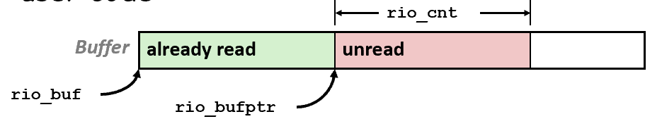
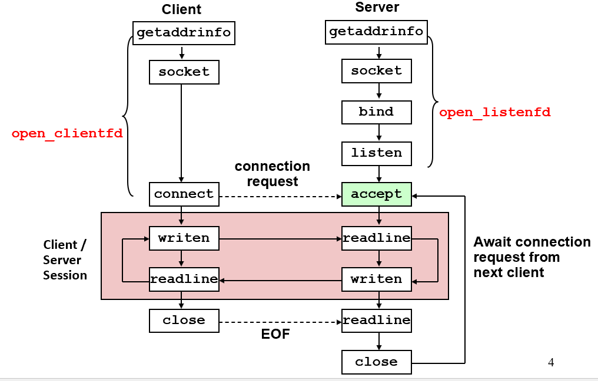
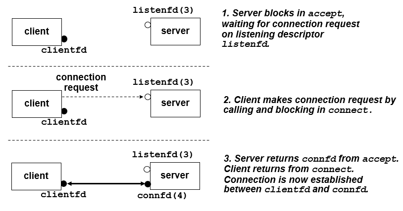
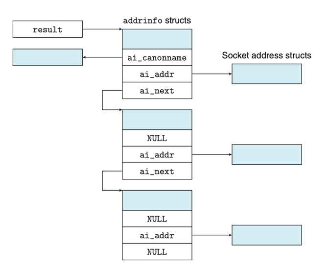

# CH11-Network Programming

## 10.5 Robust & Standard I/O

回顾Unix I/O的读写文件函数

```c
/*return:成功返回读的字节数，已经EOP就为0，出错返回-1*/
ssize_t read(int fd, void *buf, size_t n);

/*return:成功返回写的字节数，出错返回-1*/
ssize_t write(int fd, void *buf, size_t n);
```

### Robust I/O

健壮的I/O包能够处理系统级函数read和write的不足值，提供两类函数：无缓冲和缓冲

#### Unbuffered Input and Output

```c
ssize_t rio_readn(int fd, void *buf, size_t count){
    size_t nleft = count;
    ssize_t nread;
    char *ptr = buf;
    while (nleft > 0) { /* 一次read可能不能读完所有需要的字节，所以使用while，保证读完字节 */
        if ((nread = read(fd, ptr, nleft)) < 0) {
            if (errno == EINTR) /* 只是被信号中断，只废弃本轮循环 */
                nread = 0; /* and call read() again */
            else
                return -1; /* errno set by read() */
        }
        else if (nread == 0)
            break; /* EOF */
        nleft -= nread;
        ptr += nread;
    }
    return (count - nleft); /* return >= 0 */
}
```

```c
ssize_t rio_writen(int fd, const void *buf, size_t count){
    size_t nleft = count;
    ssize_t nwritten;
    const char *ptr = buf;
    while (nleft > 0) {
        if ((nwritten = write(fd, ptr, nleft)) <= 0) {
            if (errno == EINTR)
                nwritten = 0; /* and call write() again */
            else
                return -1; /* errorno set by write() */
        }
        nleft -= nwritten;
        ptr += nwritten;
    }
    return count;
}
```

#### Buffered I/O

提供应用级别的缓存，防止过多次发生系统调用(比如getline，不应当每读一个字节就发生一次系统调用)



```c
#define RIO_BUFSIZE 8192
typedef struct {
    int rio_fd;                /* descriptor for this internal buf */
    int rio_cnt;               /* unread bytes in internal buf */
    char *rio_bufptr;          /* next unread byte in internal buf */
    char rio_buf[RIO_BUFSIZE]; /* internal buffer */
} rio_t;

void rio_readinitb(rio_t *rp, int fd)
{
    rp->rio_fd = fd ;
    rp->rio_cnt = 0 ;
    rp->rio_bufptr = rp->rio_buf ;
}
```

```c
static ssize_t rio_read(rio_t *rp, char *usrbuf, size_t n){
    int cnt = 0;
    while (rp->rio_cnt <= 0) { /* refill if buf is empty */
        rp->rio_cnt = read(rp->rio_fd, rp->rio_buf, sizeof(rp->rio_buf)); 
        if (rp->rio_cnt < 0) {
            if (errno != EINTR)
                return –1 ;
        }
        else if (rp->rio_cnt == 0) /* EOF */
            return 0;
        else
            rp->rio_bufptr = rp->rio_buf;/* reset buffer ptr */
    }
/* Copy min(n, rp->rio_cnt) bytes from internal buf to user buf */
    cnt = n ;
    if (rp->rio_cnt < n)
        cnt = rp->rio_cnt ;
    memcpy(usrbuf, rp->rio_bufptr, cnt) ;
    rp->rio_buffer += cnt ;
    rp->rio_cnt -= cnt ;
    return cnt ;
}
```

该函数能重新加载缓存，并读取小于buffer大小的字节数，如果大于缓存大小，就需要while包装一层

```c
ssize_t rio_readnb(rio_t *rp, void *usrbuf, size_t n){
    size_t nleft = n; ssize_t nread ;
    char *bufp = usrbuf; 	
    while (nleft > 0) {
        if ((nread = rio_read(rp, bufp, nleft)) < 0) {
            if (errno = EINTR) /* interrupted by sig handler return */
                nread = 0;
            else
                return –1;
        }
        else if (nread == 0)
            break;
        nleft -= nread;
        bufp += nread;
    }
    return (n – nleft);
}
```

```c
ssize_t rio_readlineb(rio_t *rp, void *usrbuf, size_t maxlen){
    int n, rc;
    char c, *bufp = usrbuf;
    for (n = 1; n < maxlen; n++) { /* 应当从1开始循环，因为需要在字符串结尾放上'\0' */
        if ((rc = rio_read(rp, &c, 1)) == 1) {
            *bufp++ = c;
            if (c == ‘\n’) 
                break;
        } else if (rc == 0) {
            if (n == 1) 
                return 0; /* EOF, no data read */
            else 
                break; /* EOF, some data was read */
        } else 
            return –1; /* error */
    }
    *bufp = 0 ; /* Add terminal NULL to the text line */
    return n ;
}
```

### Standard I/O

C语言封装并提供了std库的高级输入输出函数，也最常使用；当出现信号处理时，Unix I/O才能提供异步信号安全的函数；RIO则用于网络套接字

## 11.1 Introduction to Networks

## 11.4 Socket Interface



从Linux内核角度看，套接字就是通信的一个端点；从Linux程序角度看，套接字就是一个有相应描述符的打开文件
也就是将I/O设备都抽象成文件的读写

### Key data structures

```c
/* Internet address */
struct in_addr {
  uint32_t s_addr; /* 32-bit IP address */ 
};
```

为了适配各种类型的sockaddr，所以有struct sockaddr

```c
/* IP socket address structure*/
struct sockaddr_in  {
  uint16_t sin_family; /*Address family (AF_INET) */
  uint16_t sin_port;   /*Port number*/
  struct in_addr  sin_addr;   /*IP address*/
  unsigned char sin_zero[8];   /*Pad to “sockaddr”*/
};
/* Generic socket address structure */
struct sockaddr {
  uint16_t sin_family;  /*Protocol family*/
  char     sa_data[14]; /*address data*/
};
typedef struct sockaddr SA;
```

### Basic Function

- **socket**:创建套接字描述符，成功返回非负描述符，默认是主动套接字(即被客户端所有)

  ```c
  int socket(int domain, int type, int protocol);
  ```

  使用如下方法使套接字成为连接的端点

  ```c
  clientfd = socket(AF_INET, SOCK_STREAM, 0);
  ```

- **connect**:客户端建立与服务器的连接

  ```c
  int connect(int clientfd, const struct sockaddr *addr, socklen_t addrlen);
  ```

- **bind->listen->accept**:服务器与客户端连接
  - **bind**: 将套接字地址与套接字描述符连接在一起

    ```c
    int bind(int sockfd, const struct sockaddr *addr, socklen_t addrlen);
    ```

  - **listen**: 让套接字描述符变成监听套接字，即成为可以接受客户端连接请求的服务端套接字，把backlog设得较大

    ```c
    int listen(int sockfd, int backlog);
    ```

  - **accept**: 等待客户端连接，其等待clientfd使用connect连接到listenfd，连接之后，设置addr为客户端套接字地址，并返回一个已连接描述符

    

    ```c
    int accept(int listenfd, struct sockaddr *addr, int *addrlen);
    ```

### Host and Service Conversion

实现二进制套接字地址结构和主机名、主机地址、服务名、端口号组成的字符串的相互转换

```c
struct addrinfo {
    int ai_flags;       /* Hints argument flags */
    int ai_family;      /* First arg to socket function */
    int ai_socktype;    /* Second arg to socket function */
    int ai_protocol;    /* Third arg to socket function */
    char *ai_canonname; /* Canonical hostname */
    size_t ai_addrlen;  /* Size of ai_addr struct */
    struct sockaddr *ai_addr;   /* Ptr to socket address structure */
    struct addrinfo *ai_next;   /* Ptr to next item in linked list */
};
```

对于前三个参数，有以下规定：

- **family: AF_INET,AF_INET6**(分别对应IPv4和IPv6)
- **socktype:SOCK_STREAM,SOCK_DGRAM,SOCK_RAW**
- **protocol:0**(指代套接字的协议，为0说明任意协议均可)

相关函数如下，使用getaddrinfo来实现字符串转结构体(返回一个链表)，getnameinfo实现结构体转字符串



```c
#include <sys/types.h>
#include <sys/socket.h>
#include <netdb.h>
// 成功返回0；错误返回非零的错误代码
int getaddrinfo(const char *host, const char *service, 
                const struct addrinfo *hints,
                struct addinfo **result);
// 释放链表中的结构体
void freeaddinfo(struct addinfo *result);
// 返回错误信息
Const char *gai_strerror(int errocde);
// 成功返回0；错误返回非零的错误代码
int getnameinfo(const struct sockaddr *sa, socklen_t salen, 
                char *host, size_t hostlen,  
                char *service, size_t servlen, int flags); 
```

下面的例子展示了如何实现展示域名和它关联的IP地址的映射

```c
#include <stdlib.h>
#include <stdio.h>
#include <sys/types.h>
#include <sys/socket.h>
#include <netdb.h>
#include <string.h>
#define MAXLINE 128
int main(int argc, char ** argv)
{
    struct addrinfo *p, *listp, hints;
    char buf[MAXLINE];
    int rc, flags;
    if(argc != 2) {
        fprintf(stderr, "usage: %s <domain name>\n", argv[0]);
        exit(0);
    }
    // 获取所有能对上的IP地址，将它们都压入链表
    memset(&hints, 0, sizeof(struct addrinfo));
    hints.ai_family = AF_INET; // 只限于IPv4
    hints.ai_socktype = SOCK_STREAM; // 只连接
    if((rc = getaddrinfo(argv[1], NULL, &hints, &listp)) != 0){
        fprintf(stderr,"getaddrinfo error: %s\n", gai_strerror(rc));
        exit(0);
    }
    // 遍历链表，并输出相应IP地址
    flags = NI_NUMERICHOST; // 字符串而非域名
    for(p = listp; p; p = p->ai_next){
        getnameinfo(p->ai_addr, p->ai_addrlen, buf, MAXLINE, NULL, 0, flags);
        printf("%s\n", buf);
    }
    // 释放
    freeaddrinfo(listp);
    exit(0);
}
```

### Echo client

使用open_clientfd和open_listenfd分别创建客户端与服务端的描述符，从而使用Unix I/O进行输入输出

使用getaddrinfo获取链表，遍历链表获取套接字(socket)并连接(connect)

```c
int open_clientfd(char *hostname, char *port) {
    int clientfd;
    struct addrinfo hints, *listp, *p;
    /* Get a list of potential server addresses */
    memset(&hints, 0, sizeof(struct addrinfo));
    hints.ai_socktype = SOCK_STREAM; /* Open a connection */
    hints.ai_flags = AI_NUMERICSERV;  /* Use a numeric port arg @port */
    hints.ai_flags |= AI_ADDRCONFIG;   /* Recommended for connections */
    getaddrinfo(hostname, port, &hints, &listp);
    /* Walk the list for one that we can successfully connect to */
    for (p = listp; p; p = p->ai_next) {
        /* Create a socket descriptor */
        if ((clientfd = socket(p->ai_family, p->ai_socktype, p->ai_protocol)) < 0)
            continue;   /* Socket failed, try the next */
        /* Connect to the server */
        if (connect(clientfd, p->ai_addr, p->ai_addrlen) != -1)
            break;      /* Success */
        Close(clientfd);    /* Connect failed, try another */
    }
    /* Clean up */
    Freeaddrinfo(listp);
    if (!p)     /* All connects failed */
        return -1;
    else    /* The last connect succeeded */
        return clientfd;
}
```

客户端在main函数中调用open_clientfd，并使用创建的描述符进行读写

```c
int main(int argc, char **argv)
{
    int clientfd;
    char *host, *port, buf[MAXLINE];
    rio_t rio;

    if (argc != 3) {
       fprintf(stderr,"usage:%s <host> <port>\n",argv[0]);
       exit(0);
    }
    host = argv[1]; port = argv[2];
    clientfd = open_clientfd(host, port);
    Rio_readinitb(&rio, clientfd) ;

    while (Fgets(buf, MAXLINE, stdin) != NULL) {
        Rio_writen(clientfd, buf, strlen(buf));
        Rio_readline(&rio, buf, MAXLINE);
        Fputs(buf, stdout);
    }
    Close(clientfd);
}
```

### Echo Server

open_listenfd同样使用getaddrinfo获取链表，遍历链表创建套接字(socket)，配置服务器(setsocketopt)并使用bind将服务器套接字地址与套接字描述符联系起来，最后使用listen让套接字可以监听客户端的连接请求

```c
int open_listenfd(char *port)
{
    struct addrinfo hints, *listp, *p;
    int listenfd, optval=1;
    /* Get a list of potential server addresses */
    memset(&hints, 0, sizeof(struct addrinfo));
    hints.ai_socktype = SOCK_STREAM; /* Accept connections */
    hints.ai_flags = AI_PASSIVE | AI_ADDRCONFIG; 
    hints.ai_flags |= AI_NUMERICSERV; /* using @port number */
    Getaddrinfo(NULL, port, &hints, &listp);
    /* Walk the list for one that we can bind to */
    for (p = listp; p; p = p->ai_next) {
        /* Create a socket descriptor */
        if ((listenfd = socket(p->ai_family, p->ai_socktype, p->ai_protocol)) < 0)
            continue;   /* Socket failed, try the next */
        /* Eliminates "Address already in use" error from bind */
        setsockopt(listenfd, SOL_SOCKET, SO_REUSEADDR,(const void *)&optval , sizeof(int));
        /* Bind the descriptor to the address */
        if (bind(listenfd, p->ai_addr, p->ai_addrlen) == 0)
            break;      /* Success */
        Close(listenfd);    /* Bind failed, try the next */
    }
    /* Clean up */
    freeaddrinfo(listp);
    if (!p)     /* No address worked */
        return -1;
    /* Make it a listening socket ready to accept connection requests */
    if (listen(listenfd, LISTENQ) < 0) {
        Close(listenfd);
        return -1;
    }
    return listenfd;
}
```

而服务端的main函数使用accept等待服务端的连接，连接成功后，使用echo函数进行读写，最后close已连接描述符

```c
#include "csapp.h"

void echo(int connfd);

int main(int argc, char **argv)
{
    int listenfd, connfd;
    socklen_t clientlen;
    struct sockaddr_storage clientaddr; /* Enough space for any address */
    char client_hostname[MAXLINE], client_port[MAXLINE];
    if (argc != 2) {
        fprintf(stderr, "usage: %s <port>\n", argv[0]);
        exit(0);
    }
    listenfd = Open_listenfd(argv[1]);
    while (1) {
        clientlen = sizeof(struct sockaddr_storage);
        connfd = accept(listenfd, (SA *)&clientaddr, &clientlen);
        getnameinfo((SA *) &clientaddr, clientlen, client_hostname, MAXLINE, client_port, MAXLINE, 0);
        printf("Connected to (%s, %s)\n", client_hostname, client_port);
        echo(connfd);
        Close(connfd);
    }
    exit(0);
}
```

最后介绍echo函数

```c
  void echo(int connfd)
  {
        size_t n;
        char buf[MAXLINE];
        rio_t rio

        Rio_readinitb(&rio, connfd)
        while((n = Rio_readlineb(&rio, buf, MAXLINE))!=0){
                  printf("server received %d bytes\n", n);
                  Rio_writen(connfd, buf, n);
        }
}
```

## 11.5 Web Server

### Web content

内容是与一个MIME类型相关的字节序列，常见的如下
> **text/html**        HTML page
> **text/plain**        Unformatted text
> **application/postscript**      Postcript document
> **image/gif**   Binary image encoded in GIF format
> **image/jpg**   Binary image encoded in JPG format

内容分为静态内容和动态内容

### HTTP Transactions

使用linux的TELNET程序来和因特网上的web服务器执行事务，输入以下指令后会打印三行输出，接下来可以发送HTTP请求并获得HTTP响应

```shell
//Client: open connection to server
unix> telnet ipads.se.sjtu.edu.cn 80
//Telnet prints 3 lines to the terminal
Trying 202.120.40.85...
Connected to ipads.se.sjtu.edu.cn.
Escape character is '^]'.
//Client: request line
GET /courses/ics/index.shtml HTTP/1.1
//Client: required HTTP/1.1 HOST header
host: ipads.se.sjtu.edu.cn
//Client: empty line terminates headers
//Server: response line
HTTP/1.1 200 OK
//Server: followed by five response headers
Server: nginx/1.0.4
Date: Thu, 29 Nov 2012 10:15:38 GMT
//Server: expect HTML in the response body 
Content-Type: text/html
//Server: expect 11,560 bytes in the response body
Content-Length: 11560
//Server: empty line (“\r\n”) terminates hdrs
//Server: first HTML line in response body
<!DOCTYPE html PUBLIC "-//W3C//DTD HTML 4.01 Transitional//EN">
<html>  
... //Server: 292 lines of HTML not shown. 
</html>   //Server: last HTML line in response body
//Server: closes connection 
Connection closed by foreign host. 
Client: closes connection and terminates 
unix>
```


#### HTTP Requests

request line格式为：

```shell
method URI version
```

method指定方法，如GET,POST,OPTIONS等等；URI是URL的后缀(而当使用proxy时必须是完整的URL)；version指定HTTP版本，如HTTP/1.1
request line会紧跟着零或更多的request headers，从而提供更多的信息，格式如下，注意一般来说使用Host报头

```shell
header-name: header-data
```

#### HTTP Responses

HTTP响应输出一个response line，紧跟着零或多个response headers，最后返回response body
response line格式如下：

```shell
version status-code status-msg
```

其中version还是描述HTTP版本；status-code是一个3位数字，后面会列出常见的状态码；status-msg给出与错误码等价的英文描述
> **200 OK**                Request was handled without error
> **301 Moved**             Provide alternate URL
> **403 Forbidden**         Server lacks permission to access file
> **404 Not found**         Server couldn’t find the file
> **501 Not Implemented**         Server does not support the request method
> **505 HTTP version not supported**    Server does not support version in request

response header格式与request header一致，注意两个最重要的报头：Content-Type告诉响应主体中的MIME内容类型；Content-Length指示响应主体字节大小

### Serving dynamic content

#### How does the client pass program arguments to the server?

在URI中指定传递的参数，比如URI中包含"/cgi-bin"，认为是在请求一个动态内容

#### How does the server pass these arguments to the child?

服务端接受请求后，调用fork函数创建子进程，并使用execve在子进程上下文中执行/cgi-bin/adder程序(即CGI程序)，环境变量QUERY_STRING被设置为URI中'?'后的参数

#### How does the server pass other info relevant to the request to the child?

使用CGI定义的其他环境变量设置
> QUERY_STRING (contains GET args)
> SERVER_PORT
> REQUEST_METHOD (GET, POST, etc)
> REMOTE_HOST (domain name of client)
> REMOTE_ADDR (IP address of client)
> CONTENT_TYPE (for POST, MIME type of the request body )
> CONTENT_LENGTH (for POST, length in bytes)

#### How does the server capture the content produced by the child?

子进程将动态内容发送到stdout，在执行CGI程序之前，使用dup2函数将stdout重定向到已连接描述符，且子进程需要负责Content-type和Content-length响应报头，以及终止报头的空行

## 11.6 Tiny Web Server

待补充笔记

```c
/*
* tiny.c - A simple HTTP/1.0 Web server that uses the
* GET method to serve static and dynamic content.
*/
#include "csapp.h"

void doit(int fd);
void read_requesthdrs(int fd);
int parse_uri(char *uri, char *fname, char *cgiargs);
void serve_static(rio_t *rio, char *fname, int fsize);
void get_filetype(char *fname, char *ftype);
void serve_dynamic(rio_t *rio,char *fname,char*cgiargs);
void clienterror(rio_t *rio, char *cause, char *errnum, char *shortmsg, char *longmsg);
int main(int argc, char **argv)
{
    int listenfd, connfd; 
    char hostname[MAXLINE], port[MAXLINE];
    socklen_t clientlen;
    struct sockaddr_storage clientaddr;
    /* check command line args */
    if (argc != 2) {
        fprintf(stderr,"usage: %s <port>\n", argv [0]);
        exit(1);
    }
    listenfd = open_listenfd(argv[1]);
    while (1) {
        clientlen = sizeof(clientaddr);
        connfd = Accept(listenfd, (SA *)&clientaddr, &clientlen);
        Getnameinfo((SA*)&clientaddr, clientlen, hostname, MAXLINE, port, MAXLINE, 0)
        printf(“Accepted Connection from (%s, %s)\n”, hostname, port); 
        doit(connfd);
        Close(connfd);
    }
}
```

```c
void doit(int fd)
{
    int is_static;
    struct stat sbuf;
    char buf[MAXLINE], method[MAXLINE], uri[MAXLINE], version[MAXLINE];
    char filename[MAXLINE], cgiargs[MAXLINE];
    rio_t rio;
    /* Read request line and headers */
    Rio_readinitb(&rio, fd);
    Rio_readlineb(&rio, buf, MAXLINE);
    printf("Request headers:\n");
    printf("%s", buf);
    sscanf(buf, "%s %s %s", method, uri, version);
    if (strcasecmp(method, "GET")) {
        clienterror(fd, method, "501", "Not implemented", "Tiny does not implement this method");
        return;
    }
    read_requesthdrs(&rio);
    /* Parse URI from GET request */
    is_static = parse_uri(uri, filename, cgiargs);
    if (stat(filename, &sbuf) < 0) {
        clienterror(fd, filename, "404", "Not found", "Tiny couldn’t find this file");
        return;
    }
    if (is_static) { /* Serve static content */
        if (!(S_ISREG(sbuf.st_mode)) || !(S_IRUSR & sbuf.st_mode)) {
            clienterror(fd, filename, "403", "Forbidden", "Tiny couldn’t read the file");
            return;
        }
        serve_static(fd, filename, sbuf.st_size);
    }
    else { /* Serve dynamic content */
        if (!(S_ISREG(sbuf.st_mode)) || !(S_IXUSR & sbuf.st_mode)) {
            clienterror(fd, filename, "403", "Forbidden", "Tiny couldn’t run the CGI program");
            return;
        }
        serve_dynamic(fd, filename, cgiargs);
    }
}
```

```c
void clienterror(int fd, char *cause, char *errnum, char *shortmsg, char *longmsg)
{
    char buf[MAXLINE], body[MAXBUF];
    /* build the HTTP response body */
    sprintf(body, "<html><title>Tiny Error</title>");
    sprintf(body, "%s<body bgcolor=""ffffff"">\r\n", body);
    sprintf(body, "%s%s: %s\r\n", body, errnum, shortmsg);
    sprintf(body, "%s<p>%s: %s\r\n", body, longmsg, cause);
    sprintf(body, "%s<hr><em>Tiny Web server</em>\r\n",body);
    /* print the HTTP response */
    sprintf(buf, "HTTP/1.0 %s %s\r\n", errnum, shortmsg);
    Rio_writen(fd, buf, strlen(buf));
    sprintf(buf, "Content-type: text/html\r\n");
    Rio_writen(fd, buf, strlen(buf));
    sprintf(buf, "Content-length: %d\r\n\r\n", strlen(body));
    Rio_writen(fd, buf, strlen(buf));
    Rio_writen(fd, body, strlen(body));
}
```

```c
void read_requesthdrs(rio_t *rp)
{
    char buf[MAXLINE];
    Rio_readline(rp, buf, MAXLINE);
    while(strcmp(buf, "\r\n")){
        Rio_readlineb(rp, buf, MAXLINE);
        printf(“%s”, buf);
    }
    return;
}
```

```c
int parse_uri(char *uri, char *filename, char *cgiargs)
{
    char *ptr;
    if (!strstr(uri, "cgi-bin")) { /* static content */
        strcpy(cgiargs, "");
        strcpy(filename, ".");
        strcat(filename, uri);
        if (uri[strlen(uri)-1] == ’/’)
            strcat(filename, "home.html");
        return 1;
    }
    else { /* dynamic content */
        ptr = index(uri, ’?’);
        if (ptr) {
            strcpy(cgiargs, ptr+1);
            *ptr = ’\0’;
        } else
            strcpy(cgiargs, "");
        strcpy(filename, ".");
        strcat(filename, uri);
        return 0;
    }
}
```

```c
void serve_static(int fd, char *filename, int filesize)
{
    int srcfd;
    char *srcp, ftype[MAXLINE], buf[MAXBUF];
    /* send response headers to client */
    get_filetype(filename, ftype);
    sprintf(buf, "HTTP/1.0 200 OK\r\n");
    sprintf(buf, "%sServer: Tiny Web Server\r\n", buf);
    sprintf(buf, "%sConnection: close\r\n", buf);
    sprintf(buf, "%sContent-length: %d\n", buf, filesize);
    sprintf(buf, "%sContent-type: %s\r\n\r\n", buf, ftype);
    Rio_writen(fd, buf, strlen(buf));
    printf(“Response headers:\n”);
    printf(“%s”, buf);
    /* send response body to client */
    srcfd = Open(filename, O_RDONLY, 0);
    srcp = Mmap(0,filesize,PROT_READ,MAP_PRIVATE,srcfd,0);
    Close(srcfd);
    Rio_writen(fd, srcp, filesize);
    Munmap(srcp, filesize);
}
```

```c
/*
* get_filetype - derive file type from file name
*/
void get_filetype(char *filename, char *filetype)
{
    if (strstr(filename, ".html"))
        strcpy(filetype, "text/html");
    else if (strstr(filename, ".gif"))
        strcpy(filetype, "image/gif");
    else if (strstr(filename, ".png"))
        strcpy(filetype, "image/png");
    else if (strstr(filename, ".jpg"))
        strcpy(filetype, "image/jpg");
    else
        strcpy(filetype, "text/plain");
}
```

```c
void serve_dynamic(int fd, char *filename, char *cgiargs)
{
    char buf[MAXLINE];
    /* return first part of HTTP response */
    sprintf(buf, "HTTP/1.0 200 OK\r\n");
    Rio_writen(fd, buf, strlen(buf));
    sprintf(buf, "Server: Tiny Web Server\r\n\r\n");
    Rio_writen(fd, buf, strlen(buf));
    if (Fork() == 0) { /* child */
        /* real server would set all CGI vars here */
        setenv("QUERY_STRING", cgiargs, 1);
        Dup2(fd, STDOUT_FILENO); /* redirect output to client*/
        Execve(filename, NULL, environ); /* run CGI program */
    }
    Wait(NULL); /* parent reaps child */
}
```
