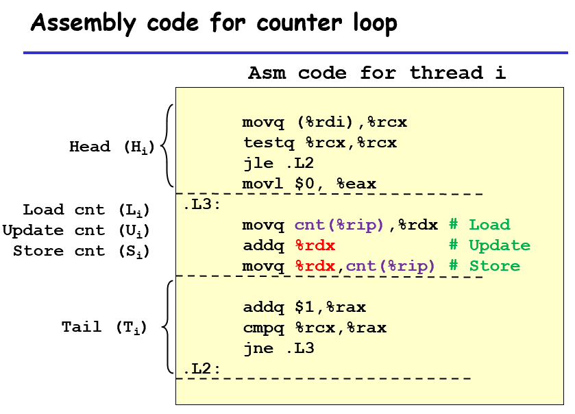
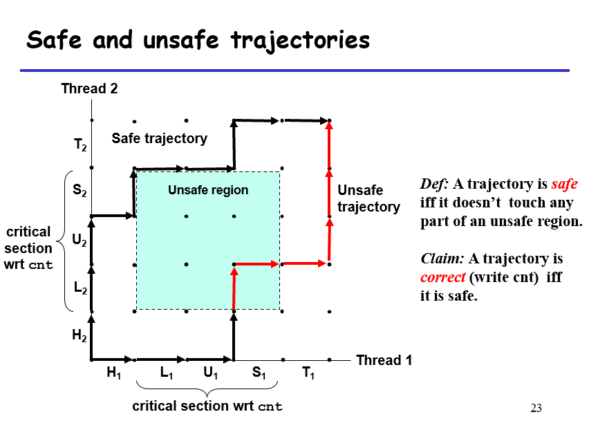
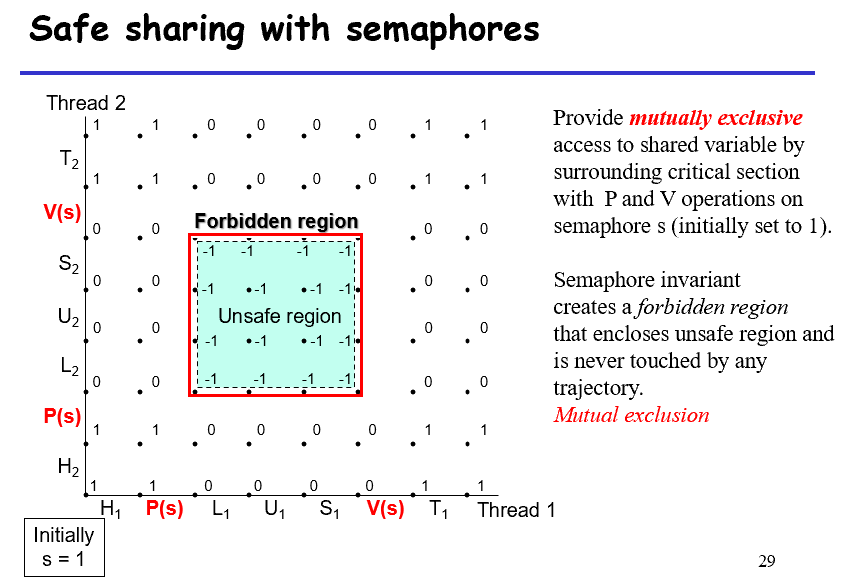
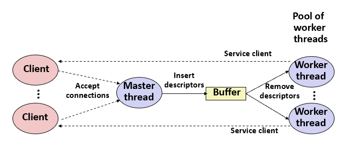
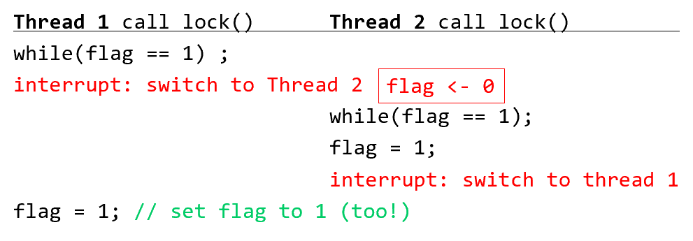
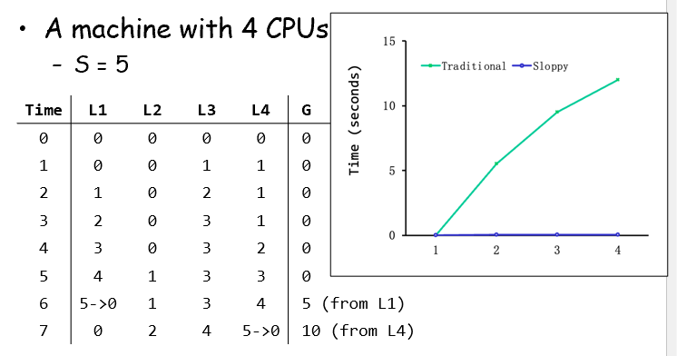

# Ch12-Concurrent Porgramming

## 12.1-3 Concurrent Program

以并发的echo网络编程为例，原来的echo服务器一次只能处理一个客户端的请求，accept会滞留一段时间，现在的服务器可以并发地执行多个客户端读写

### Concurrent Programming with processes

```c
int main(int argc, char **argv) 
{
   int listenfd, connfd;
   struct sockaddr_in clientaddr;
   socklen_t clientlen = sizeof(clientaddr);

   Signal(SIGCHLD, sigchld_handler);
   listenfd = Open_listenfd(argv[1]);
   while (1) {
      connfd = Accept(listenfd, (SA *) &clientaddr, &clientlen);
      if (Fork() == 0) { 
         Close(listenfd); /* Child closes its listening socket */
         echo(connfd);    /* Child services client */
         Close(connfd);   /* Child closes connection with client */
         exit(0);         /* Child exits */
      }
      Close(connfd); /* Parent closes connected socket (important!) */
   }
}
```

这里为每个请求都开一个新的子进程处理。为避免内存泄漏，父子进程应当关闭他们各自的connfd；需要使用SIGCHID处理程序回收多个僵死子进程

```c
void sigchld_handler(int sig) 
{
   while (waitpid(-1, 0, WNOHANG) > 0)
    ;
   return;
}
```

#### Pros and cons of process

**优点**：进程的模型清晰，共享文件表而不共享用户地址空间，不会覆盖另一个进程的虚拟内存
**缺点**：进程间共享状态变得困难，必须使用显式的IPC(进程间通信)，而且因为开销大，会很慢

### Concurrent Programming with threads

一个进程中可以运行多个线程，每个线程有自己的线程上下文，有单独的逻辑控制流，包括TID、栈、栈指针、程序计数器、通用目的寄存器和条件码；一个进程里的线程共享进程的虚拟地址空间，包括代码、数据、堆、共享库和打开的文件。
一个进程的所有线程构成一个对等池(peer thread)

#### Posix threads (Pthreads) interface

C程序处理线程的一个标准接口，主要有：

- 创建线程：
  
  ```c
  int pthread_create(pthread_t *tid, NULL, func *f, void *arg); // 获取tid，设置线程例程函数和参数
  ```

- 获取tid：

   ```c
   pthread_t pthread_self(void);
   ```

- 回收进程：

   ```c
   int pthread_join(pthread_t tid, void** thread_return); // 获得返回值
   ```

- 终止进程：exit终止所有线程

   ```c
   void pthread_exit(void *thread_return);
   int pthread_cancel(pthread_t tid);
   ```

- 分离线程：默认线程可结合，即需要被其它线程显式回收，否则不会释放；修改为分离的，无法被其它线程杀死或回收，但会自动释放

   ```c
   int pthread_detach(pthread_t tid);
   ```

- 初始化线程：

```c
/* hello.c - Pthreads "hello, world" program */
#include "csapp.h"
/* thread routine */
void *thread(void *vargp) {
  printf("Hello, world!\n"); 
  return NULL;
}
int main() {
  pthread_t tid;
  Pthread_create(&tid, NULL, thread, NULL);
  Pthread_join(tid, NULL);
  exit(0);
}
```

基于线程的并发服务器如下：

```c
int main(int argc, char **argv){
    int listenfd, *connfdp
    socklen_t clientlen;
    struct sockaddr_in clientaddr;
    pthread_t tid;
    if (argc != 2) {
        fprintf(stderr, "usage: %s <port>\n", argv[0]);
        exit(0);
    }
    listenfd = open_listenfd(argv[1]);
    while (1) {
        clientlen = sizeof(clientaddr);
        connfdp = Malloc(sizeof(int));
        *connfdp = Accept(listenfd, (SA *)&clientaddr, &clientlen);
        Pthread_create(&tid, NULL, thread, connfdp);
    }
}
```

```c
/* thread routine */
void *thread(void *vargp)
{
    int connfd = *((int *)vargp);
    Pthread_detach(pthread_self());
    Free(vargp);
    echo(connfd);
    Close(connfd);
    return NULL;
}
```

这里的create不能直接给&connfd，因为会引发赋值与accept的竞争，可能拿成下一次的connfd

#### Pros and cons of thread

**好处**：易于在线程间分享数据结构；开销小于进程，更高效
**缺点**：容易出现无意识的分享，且难以发现

### Concurrent Programming with I/O Multiplexing

```c
#include <sys/select.h>
int select (int maxfd, fd_set *readset, NULL, NULL, NULL);
void FD_ZERO(fd_set *fdset);/* clear all bits in fdset. */
void FD_CLR(int fd, fd_set *fdset);/* clear bit fd in fdset */
void FD_SET(int fd, fd_set *fdset);/* turn on bit fd in fdset */
int FD_ISSET(int fd, *fdset);/* Is bit fd in fdset on? */
```

使用select函数，其休眠到有一个或多个描述符准备好读，返回准备好的描述符数，并重新设置readset，指示准备情况；而maxfd指示检查readset的前maxfd个描述符；初始的readset则会设置需要监听的描述符

下面的例子既响应客户端连接，又响应标准输入

```c
#include “csapp.h”

int main(int argc, argv)
{
    int listenfd, connfd;
    socklen_t clientlen=sizeof(struct sockaddr_in);
    struct sockaddr_in clientaddr;
    fd_set read_set, ready_set;
    if (argc != 2) {
       fprintf(stderr, “usage: %s <port>\n”,argv[0]);
       exit(0);
    }
    listenfd = Open_listenfd(argv[1]);
    FD_ZERO(&read_set);
    FD_SET(STDIN_FILENO, &read_set);
    FD_SET(listenfd, &read_set);
    while(1) {
        ready_set = read_set;
        Select(listenfd+1, &ready_set,
               NULL, NULL, NULL);
        if (FD_ISSET(STDIN_FILENO, &ready_set)
            /*read command line from stdin */
            command();
        if (FD_ISSET(listenfd, &ready_set)){
            connfd = Accept(listenfd, (SA *)&clientaddr, &clientlen);
            echo(connfd);
        }
    }
}
```

```c
void command(void)
{
    char buf[MAXLINE];
    if (!Fgets(buf, MAXLINE, stdin))
        exit(0);/* EOF */
    /*Process the input command */
    printf(“%s”, buf);
}
```

select函数沉睡直到：

- 新的用户端连接到达，其使用listenfd监听，那么建立连接，使用accept和echo
- 新的数据到达标准输入，使用STDIN_FILENO监听，调用command来进行读取响应

下面的例子给出了并发服务器：

```c
 #include “csapp.h”
 typedef struct {/* represents a pool of connected descriptors */
      int maxfd;
      fd_set read_set;
      fd_set ready_set;
      int nready;
      int maxi;
      int clientfd[FD_SETSIZE];
      rio_t clientrio[FD_SETSIZE];
 } pool;
 int byte_cnt = 0; /*counts total bytes received by server */
 int main()
 {
   int listenfd, connfd; 
   socketlen_t clientlen = sizeof(struct sockaddr_in);
   struct sockaddr_in clientaddr;
   static pool pool ;
   if (argc != 2) {
      fprintf(stderr, “usage” %s <port>\n”, argv[0]);
      exit(0);
   }
   
   listenfd = Open_listenfd(argv[1]);
   init_pool(listenfd, &pool);
   while (1) {
        /* wait for listening/connected descriptor(s) to become ready*/
        pool.ready_set = pool.read_set;
        pool.nready = Select(pool.maxfd+1,&pool.ready_set, NULL,NULL,NULL);
        /* If listening descriptor ready, add new client to pool*/
        if (FD_ISSET(listenfd, &pool.ready_set)) {
        connfd=Accept(listenfd, (SA *)&clientaddr, &clientlen);
        add_client(connfd, &pool);
        }
        /*Echo a text line form each ready connected descriptor */
        check_clients(&pool);
      }
 }
```

```c
 void init_pool(int listenfd, pool *p)
 {
   /*Initially, there are no connected descriptors */
   int i;
   p->maxi = -1;
   for (i = 0; i < FD_SETSIZE; i++)
      p->clientfd[i] = -1;
   /* Initially, listenfd is only member of select read set */
   p->maxfd = listenfd ;
   FD_ZERO(&p->read_set);
   FD_SET(listenfd, &p->read_set);
 } 
```

```c
 void add_client(int connfd, pool *p)
 {
   int i;
   p->nready--;
   for (i = 0; i < FD_SETSIZE; i++)  /* Find an available slot */
      if (p->clientfd[i] < 0) {
          /* Add connected descriptor to the pool */
          p->clientfd[i] = connfd;
          Rio_readinitb(&p->clientrio[i], connfd);
          /*Add the descriptor to descriptor set */
          FD_SET(connfd, &p->read_set);
          /* Update max descriptor and pool highwater mark */
          if (connfd > p->maxfd)
         p->maxfd = connfd ;
          if (i > p->maxi)
         p->maxi = i;
          break;
      }
   if (i == FD_SETSIZE) 	/* Couldn’t find an empty slot */
      app_error(“add_client error: Too many clients”);
 }
```

```c
 void check_clients(pool *p)
 {
   int i, connfd n;
   char buf[MAXLINE];
   rio_t rio;
   for (i = 0; (i <= p->maxi) && (p->nready > 0); i++) {
      connfd = p->clientfd[i];
      rio = p->clientrio[i];
      
      /*If the descriptor is ready, echo a text line from it */
      if ((connfd>0) && (FD_ISSET(connfd, &p->ready_set))) {
         p->nready--;
         if ((n = Rio_readlineb(&rio, buf, MAXLINE)) != 0) {
            byte_cnt += n;
            printf(“Server recerived %d (%d total)
                bytes on fd %d\n”, n, byte_cnt, connfd);
            Rio_writen(connfd, buf, n);
         }
         /* EOF detected, remove descriptor from pool */
         else {
            Close(connfd);
            FD_CLR(connfd, &p->read_set);
            p->clientfd[i]=-1;
         }
      }
   }
 }
```

#### Pros and cons of I/O Multiplexing

**优点**：一个逻辑控制流，可单步debug
**缺点**：代码复杂，并发颗粒度小，不能充分利用多核

## 12.4 Shared variables in threaded C programs

### Threads memory model

一组并发线程运行在一个进程的上下文中，每个线程都有自己独立的线程上下文；这些线程共享进程上下文的剩余部分
但不是绝对的，寄存器是绝对设防的，但栈不是

### Mapping Variable Instances to Memory

- 全局变量：虚拟内存只有其一个实例，任何线程都能引用
- 本地自动变量：每个线程的栈都有自己的本地自动变量的实例
- 本地静态变量：虚拟内存也只有一个实例

***TODO: Shared variable analysis***

## 12.5 Synchronizing Threads with Semaphores



执行上述的两个线程，这五步的交错顺序是无法确定的，可能导致计算错误

### Progress graphs

轨迹线和不安全区，不安全区的边缘是安全的，想办法同步(Synchronizing)线程，保证安全轨迹线



### Semaphores

信号量是具有非负整数值的全局变量，只能进行两种操作：

- P(s): ````while (s == 0) wait(); s--;````
- V(s): ```s++;```如果被P操作阻塞，重启某个在阻塞的线程并额外完成P操作

保证s非负，且P与s--，Q与s++是不可分割的

```c
#include <semaphore.h>
int sem_init(sem_t *sem, 0, unsigned int value);
int sem_wait(sem_t *s);  /* P(s) */
int sem_post(sem_t *s);  /* V(s) */
#include “csapp.h” 
void P(sem_t *s);/* Wrapper function for sem_wait */
void V(sem_t *s);/* Wrapper function for sem_wait */
```

使用信号量包裹不安全区的操作，就可以实现同步操作，防止进入不安全区，这是因为不安全区的信号量是负数

```c
/* thread routine */
void *count(void *arg)
{
    int i;
    for (i=0; i<NITERS; i++) {
        P(&sem);
        cnt++;
        V(&sem);
    }
    return NULL;
}
```



### Using Semaphores to Schedule Access to Shared Resources

两种信号量：counting semaphores和binary semaphores(mutex)；两个经典例子：The Producer-Consumer Problem和The Readers-Writers Problem

#### Producer-Consumer on an n-element Buffer

使用sbuf包

```c
struct {
  int *buf;     /* Buffer array */
  int n;    /* Maximum number of slots */
  int front;    /* buf[(front+1)%n] is the first item */
  int rear;   /* buf[rear%n] is the last item */
  sem_t mutex;  /* protects accesses to buf */
  sem_t slots;  /* Counts available slots */
  sem_t items;  /* Counts available items */
} sbuf_t;
```

```c
void sbuf_init(sbuf_t *sp, int n)
{
    sp->buf = Calloc(n, sizeof(int));
    /* Buffer holds max of n items */
    sp->n = n;
    /* Empty buffer iff front == rear */    
    sp->front = sp->rear = 0;
    /* Binary semaphore for locking */
    Sem_init(&sp->mutex, 0, 1);
    /* Initially, buf has n empty slots */
    Sem_init(&sp->slots, 0, n);
    /* Initially, buf has zero data items */
    Sem_init(&sp->items, 0, 0);
}
```

```c
void sbuf_insert(sbuf_t *sp, int item)
{
    /* Wait for available slot */
    P(&sp->slots);
    /*Lock the buffer */
    P(&sp->mutex);
    /*Insert the item */
    sp->buf[(++sp->rear)%(sp->n)] = item;
    /* Unlock the buffer */
    V(&sp->mutex);
    /* Announce available items*/
    V(&sp->items);
}
```

```c
void sbuf_remove(sbuf_t *sp)
{
    int item;
    /* Wait for available item */
    P(&sp->items);
    /*Lock the buffer */
    P(&sp->mutex);
    /*Remove the item */
    item = sp->buf[(++sp->front)%(sp->n)];
    /* Unlock the buffer */
    V(&sp->mutex);
    /* Announce available slot*/ 
    V(&sp->slots);
    return item;
}
```

#### Readers-Writers Problem

读者只读取对象，写者只修改对象。第一类问题为读者优先，不让读者因写者等待；第二类问题为写者优先。
对于第一类问题，如下：

```c
int readcnt;    /* Initially 0 */
sem_t mutex, w; /* Both initially 1 */

void reader(void) {
  while (1) {
    P(&mutex);
    readcnt++;
    if (readcnt == 1) /* First in */
      P(&w);
    V(&mutex);
    /* Reading happens here */
    P(&mutex);
    readcnt--;
    if (readcnt == 0) /* Last out */
      V(&w);
    V(&mutex);
  }
}
```

```c
void writer(void) {
  while (1) {
    P(&w);
    /* Writing here */ 
    V(&w);
  }
}
```

可能产生饥饿问题，即线程无限期阻塞。在这个问题中，读者不断过来，就会让写者无限期等待

### Case Study: Prethreaded Concurrent Server

基于预线程化的并发服务器



```c
#include “csapp.h”
#include “sbuf.h”
#define NTHREADS  4
#define SBUFSIZE  16
 
sbuf_t sbuf ; /* shared buffer of connected descriptors */ 

int main(int argc, char **argv)
{
    int i, listenfd, connfd;
    sockelen_t clientlen ;  
    struct sockaddr_storage clientaddr;
    pthread_t tid;   
    if (argc != 2) {
        fprintf(stderr, “usage: %s <port>\n”, argv[0]) ;
        exit(0);
    }
    listenfd = open_listenfd(argv[1]);
    sbuf_init(&sbuf, SBUFSIZE);
    for (i = 0; i < NTHREADS; i++)   /* Create worker threads */
        Pthread_create(&tid, NULL, thread, NULL);
    while (1) {
        clientlen =  sizeof(struct sockaddr_storage);
        connfd = Accept (listenfd, (SA *)&clientaddr, &clientlen);
        sbuf_insert(&sbuf, connfd);  /* Insert connfd in buffer */
    }
}
void *thread(void *vargp)
{
    Pthread_detach(pthread_self());
    while (1) {
        int connfd = sbuf_remove(&sbuf);  /* Remove connfd from buffer */
        echo_cnt(connfd);/* Service client */
        Close(connfd);
    }
}
```

```c
#include “csapp.h”
 
static int byte_cnt;/* byte counter */
static sem_t mutex;/* and the mutex that protects it */
 
static void init_echo_cnt(void)
{
    Sem_init(&mutex, 0, 1);
    byte_cnt = 0;
}
void echo_cnt(int connfd)
{
    int n; 
    char buf[MAXLINE]; 
    rio_t rio;
    static pthread_once_t once = PTHREAD_ONCE_INIT;

    Pthread_once(&once, init_echo_cnt);
    Rio_readinitb(&rio, connfd);
    while((n = Rio_readlineb(&rio, buf, MAXLINE)) != 0) {
        P(&mutex);
        byte_cnt += n;
        printf(“server received %d(%d) byte on fd %d\n”, n,byte_cnt, connfd);
        V(&mutex);
        Rio_writen(confd, buf, n);
    }
}
```

## 12.6 Using Threads for Parallelism

并行程序(parallel programs)时运行在多核处理器上的并发程序(concurrent programs)
以0~n-1的求和举例，划分成多个线程进行计算

```c
/* Thread routine for psum-mutex.c */
void *sum_mutex(void *vargp)
{
   int myid = *((int *)vargp);         /* Extract the thread ID */
   long start = myid * nelems_per_thread;         /* Start element index    */
   long end = start + nelems_per_thread;           /* End element index     */
   long i;
   for (i = start; i < end; i++) {
      p(&mutex) ;
      gsum += i;
      V(&mutex);
   }
   return NULL;
}
```

但效果很差，因为同步开销非常大，尽量避免或减小

```c
/* Thread routine for psum-array.c*/
void *sum_array(void *vargp)
{
   int myid = *((int *)vargp);   /* Extract the thread ID */
   long start = myid * nelems_per_thread;   /* Start element index */
   long end = start + nelems_per_thread;  /* End element index */
   long i;
   for (i = start; i < end; i++) {
      psum[myid] + = i ;
   }
   return NULL;
}
```

比psum_mutex快了几个数量级，使用私有变量来计算部分和，最后再加起来，因此规避了使用互斥锁
还可以进一步优化，即使用第五章的所学知识优化

## 12.7 Other Concurrency Issues

***TODO***

## Locks

### Pthread Locks

即POSIX库给出的有关线程的方法

```c
int pthread_mutex_trylock(pthread_mutex_t *mutex); // 检查mutex是否使用
int pthread_mutex_timedlock(pthread_mutex_t *mutex, struct timespec *abs_timeout); // 检查是否在规定时间内调用mutex
```

在使用锁时注意：如何建立锁；需要哪些硬件支持；操作系统支持。对于锁的评估：互斥性(mutual exclusion)；平等性(fairness,即是否会出现饥饿starvation)；性能

### Controlling Interrupts

在临界区(critical sections)让中断(interrupt)失效，是一个最简单的解决办法，适用于单处理器系统

```c
void lock(){ DisableInterrupt(); }
void unlock(){ EnableInterrupt(); }
```

缺点：

- 让所有线程都具有了使用特权操作(privileged operation)的能力，因此必须保证该操作不能滥用
- 在多处理器上失效，因为线程可以使用其他处理器进入临界区
- 长久的关闭中断可能导致中断丢失
- 效率低
  
因此只用于内核中，操作系统访问自己的共享数据结构时使用

### A Failed Attempt: Just Using Loads/Stores

```c
typedef struct __lock_t { int flag; } lock_t;

void init (lock_t *mutex) {
   mutex->flag = 0; // 0 -> lock is available, 1 -> held
}

void lock (lock_t *mutex) {
   while (mutex->flag == 1) ; // spin-wait (do nothing)
   mutex->flag = 1; // now SET it!
} 

void unlock(lock_t *mutex) { mutex->flag = 0; }
```

这个简单的尝试在正确性和性能上都具有问题。正确性上，适当的终端情况可能导致多个线程都进入到临界区(见图)，其中断发生在循环和赋值之间(因此要把它们包装成原子操作)；性能上，其无限检查flag的值(spin-waiting，自旋等待)，在单处理器上造成浪费



### Building Working Spin Locks with Test-And-Set(Atomic Exchange)

```c
int TestAndSet(int *old_ptr, int new) {
   int old = *old_ptr;  // fetch old value at old_ptr
   *old_ptr = new;      // store ‘new’ into old_ptr
   return old;          // return the old value
}
```

上述操作即为test-and-set的伪代码，且都是原子操作。基于此可以构建一个自旋锁(spin lock)，其将忙等待(不断检查锁的状态)，而不是直接将线程阻塞挂起

```c
typedef struct __lock_t { int flag; } lock_t;

void init (lock_t *lock) {
   lock->flag = 0; // 0 -> lock is available, l -> held
}

void lock (lock_t *lock) {
   while (TestAndSet(&lock->flag, 1) == 1)
      ; // spin-wait (do nothing)
} 

void unlock(lock_t *lock) { lock->flag = 0; }
```

其正确性满足；不能保证公平性(即可能导致starvation)；在单处理器上性能开销大，比如持有锁的线程被抢占时，其会调度其他所有线程并都会有一个自旋等待的开销，但在多处理器上就可以接受

### Compare-And-Swap (x86)

```c
int CompareAndSwap(int *ptr, int expected, int new){
  int original = *ptr;
  if(original == expected)
    *ptr = new;
  return original;
}

void lock(loct_t *lock){
  while(CompareAndSwap(&lock->flag, 0, 1) == 1)
    ; // spin
}
```

在test-and-set的基础上会检查锁是否等于expected

### Load-Linked and Store-Conditional (ARM)

```c
int LoadLinked(int *ptr){
  return *ptr;
}

int StoreConditional(int *ptr, int value){
  if(no update to *ptr since the LoadLinked to this addr){
    *ptr = value;
    return 1; // success!
  }
  return 0; // failed to update
}
```

```c
void lock(lock_t *lock){
  while(1){
    while(LoadLinked(&lock->flag) == 1)
      ; // spin until it's zero
    if(StoreConditional(&lock->flag, 1) == 1)
      return; // if set-to-1 was success: done
    // otherwise: try again all over
  }
}

void unlock(lock_t *lock){
  lock->flag = 0;
}
```

StoreConditional仅在该地址在LoadLinked后没有其他存储操作时才会成功，因此即使两个操作没有被包装成一个原子操作，其也可以保证成功：当中断发生在两个操作之间时，一个线程在修改了\*ptr为1,后，另一个线程因为检测到\*ptr被修改，故会失败，需要重新获取锁，从而保证了互斥

### Fetch-And-Add

```c
int FetchAndAdd(int *ptr) {
   int old = *ptr;  // fetch old value at ptr
   *ptr = old + 1;  // add 1 and store ‘new’ into ptr
   return old;      // return the old value
}
```

使用这个增加*ptr值的操作可以实现ticket lock(票据锁，为每个线程颁发一个唯一的票据，从而保证线程的公平性)

```c
typedef struct __lock_t { 
  int ticket;
  int turn;
} lock_t;

void init (lock_t *lock) {
   lock->ticket = 0;
   lock->turn   = 0;
}

void lock (lock_t *lock) {
   int myturn = FetchAndAdd(&lock->ticket);
   while (lock->turn != myturn) 
      ; // spin
} 

void unlock(lock_t *lock) { lock->turn = lock->turn + 1; }
```

使用票据获得自己的轮次，每次解锁后到下一轮，从而轮到下一个上锁。这样获得轮次的线程迟早会被轮到，避免了饥饿问题。但依然使用自旋，即某线程持有锁时，其他线程只能为检查锁而空转

### A Simple Approach: Just Yield, Baby

即在自旋时，将CPU资源放弃，并给其他线程使用(即将自己的状态从运行改为就绪)，但频繁的上下文切换和调度开销大，且让步循环无法改变饥饿问题

```c
void init () { flag = 0; }

void lock () {
   while (TestAndSet(&flag, 1) == 1) 
      yield(); // give up the CPU
} 

void unlock() { flag = 0; }
```

在只有两个线程的CPU上效果不错，让上锁的线程可以完成临界区；但线程很多时，会陷入让步循环，反复上下文切换，带来很大浪费，甚至还有饥饿问题

### Using Queues: Sleeping Instead Of Spinning

引入队列来显式决定下一个持有锁的线程

```c
typedef struct __lock_t { 
  int flag;
  int guard;
  queue_t *q;
} lock_t;

void lock_init (lock_t *lock) {
   lock->flag  = 0;
   lock->guard = 0;
   queue_init(lock->q);
}

void lock (lock_t *lock) {
   while (TestAndSet(&lock->guard, 1) == 1) 
      ; // acquire guard lock by spinning
   if (lock->flag == 0) {
      lock->flag = 1; // lock is acquired
      lock->guard = 0;
   } else {
      queue_add(lock->q, gettid());
      setpark(); //  new code
      lock->guard = 0;
      park(); // put a calling thread to sleep
   }
} 

void unlock (lock_t *lock) {
   while (TestAndSet(&lock->guard, 1) == 1) 
      ; // acquire guard lock by spinning
   if (queue_empty(lock->q)) {
      // let go of lock; no one wants it
      lock->flag = 0; 
   } else {
      // hold lock (for next thread!)
      unpark(queue_remove(lock->q)); // wake a particular thread as designated by threadID
   }
   lock->guard = 0;
} 
```

guard使得依然保留了自旋(保证一次只有一个线程到达循环后)，但结束的很快；park()和lock->guard = 0不能交换，否则不会解锁，导致死锁；唤醒线程时，flag也不会解锁，因为唤醒的线程是在lock结尾才沉睡，因此其不会设置flag为1，需要保留
但可能出现睡眠竞争，即可能在睡眠前就被唤醒，因此引入setpark()，提前声明将要睡眠

### Different OS, Different Support

比如linux使用futex来进行睡眠和唤醒

## Lock-based Concurrent Data Structures

### Concurrent Counters

#### Simple But Not Scalable

```c
typedef struct __conter_t { 
   int value; 
   pthread_mutex_t lock;
} counter_t

void init(counter *c) { 
   c->value=0; 
   pthread_mutex_init(&c->lock, NULL);
}

void increment(counter_t *c) { 
   Pthread_mutex_lock(&c->lock);
   c->value++; 
   Pthread_mutex_unlock(&c->lock);
}

void decrement(counter_t *c) { 
   Pthread_mutex_lock(&c->lock);
   c->value--; 
   Pthread_mutex_unlock(&c->lock); 
} 
```

```c
int get(counter_t *c) {
   Pthread_mutex_lock(&c->lock);
   rc = c->value; 
   Pthread_mutex_unlock(&c->lock);
   return rc
} 
```

传统的基于锁的计数器的性能很差。一般来说，如果数据结构不是特别慢，只要简单，都是可以接受的；对于完美拓展(perfect scaling)，希望的是多线程在多核处理器上的速度和单线程在单个处理器上的速度一致，即时间不会增加

#### Scalable Counting

使用sloppy counter来进行计数，具体而言，每个CPU核拥有一个本地计数器，同时还有一个全局的计数器，每个计数器都有锁
在计数时，使用本地锁来访问该线程对应的CPU核的计数器；在获取时，上锁并获取全局计数器的值，但这个值可能不精确。为了让全局计数器同步，需要让本地计数器定期传给全局计数器，并重置自己
什么时候同步是由Sloppiness(S)决定的，当某个本地计数器的值不小于这个S时，就向全局计数器写入，并重置为0



一般而言，S越大，效率越高，但误差越大；S越小，越接近传统多线程计数器

```c
typedef struct __counter_t {
  int             global        // global count
  pthread_mutex_t glock;        // global lock
  int             local[NCPUS]; // local counter (per cpu)
  pthread_mutex_t llock[NCPUS]; // ... and locks
  int             threshold;    // update frequency
} counter_t;
```

```c
// init: record threshold, init locks, init values
//       if all local counts and global count
void init (counter_t *c, int threshold) {
   c->threshold = threshold;
   c->global = 0;
   pthread_mutex_init(&c->glock, NULL);
   int i;
   for (i = 0; i < NCPUS; i++) {
      c->local[i] = 0;
      pthread_mutex_init(c->llock[i], NULL);
   }
}

// update: usually, just grab local lock and update local 
//         amount once local count has risen by ‘threshold’,
//         grab global lock and transfer local values to it
void update (counter_t *c, int threadID, int amt) {
   int cpu = threadID % NCPUS;
   pthread_mutex_lock(&c->llock[cpu]);
   c->local[cpu] += amt;                // assumes amt > 0
   if (c->local[cpu] >= c->threshold) { // transfer
      pthread_mutex_lock(&c->glock);
      c->global += c->local[cpu];
      pthread_mutex_unlock(&c->glock);
      c->local[cpu] = 0;
   }
   pthread_mutex_unlock(&c->llock[cpu]);
}

// get: just return global amount (which may not be perfect)
int get (counter_t *c) {
   pthread_mutex_lock(&c->glock);
   int val = c->global;
   pthread_mutex_unlock(&c->glock);
   return val; // only approximate!
}
```

### Concurrent Linked Lists

#### Simple Linked List

直接对所有插入和查找都上锁，并需要在异常控制流程中释放锁

```c
typedef struct __node_t { // basic node structure
  int             key;
  struct __node_t *next;
} node_t;

typedef struct __list_t { // basic list structure
  node_t          *head;
  pthread_mutex_t lock;
} list_t

void List_Init(list_t *L) {
   L->head = NULL;
   pthread_mutex_init(&L->lock, NULL);
}
```

```c
int List_Insert(list *L, int key) {
   pthread_mutex_lock(&L->lock);
   node_t *new = malloc(sizeof(node_t));
   if (new == NULL) { // exceptional control flow
      perror(“malloc”);
      pthread_mutex_unlock(&L->lock);
      return -1; // fail
   }
   new->key = key; 
   new->next = L->head; 
   L->head = new;
   pthread_mutex_unlock(&L->lock);
   return 0; // success
}
```

```c
int List_Lookup(list *L, int key) {
   pthread_mutex_lock(&L->lock);
   node_t *curr = L->head;
   while (curr) {
      if (curr->key == key) { // exceptional control flow
         pthread_mutex_unlock(&L->lock);
         return 0; // success
      }
      curr = curr->next;
   }
   pthread_mutex_unlock(&L->lock);
   return -1; // failure
}
```

进一步地，希望可以在失败时避免上锁。对于插入，考虑到malloc是线程安全的，可以缩小上锁范围；对于查找，可以统一两种情况

```c
void List_Insert(list *L, int key) {
   // synchronization not needed
   node_t *new = malloc(sizeof(node_t));
   if (new == NULL) {
      perror(“malloc”);
      return;
   }
   new->key = key; 

   // just lock critical section
   pthread_mutex_lock(&L->lock);
   new->next = L->head; 
   L->head = new;
   pthread_mutex_unlock(&L->lock);
}
```

```c
int List_Lookup(list *L, int key) {
   int rv = -1;
   pthread_mutex_lock(&L->lock);
   node_t *curr = L->head;
   while (curr) {
      if (curr->key == key) {
         rv = 0;
         break;
      }
      curr = curr->next;
   }
   pthread_mutex_unlock(&L->lock);
   return rv;
}
```

#### Scaling Linked Lists

使用hand-over-hand locking(即lock coupling,锁耦合)来拓展并发链表，即为每个结点分配锁，在释放当前结点的锁前获取下一个节点的锁，但效果是不佳的

### Concurrent Queues

简单的办法就是加一个大锁；不过在Michael and Scott Concurrent Queues中，只为头部和尾部分配锁，入队只用尾部锁，出队只用头部锁，并引入dummy结点来保证头尾节点分离

```c
typedef struct __node_t { 
  int              key;
  struct __node_t *next;
} node_t;

typedef struct __queue_t {
  node_t          *head;
  node_t          *tail;
  pthread_mutex_t  head_lock;
  pthread_mutex_t  tail_lock;
} queue_t
```

```c
void Queue_Init(queue_t *q) {
   node_t *tmp = malloc(sizeof(node_t));
   tmp->next = NULL;
   q->head = q->tail = temp;
   pthread_mutex_init(&q->head_lock, NULL);
   pthread_mutex_init(&q->tail_lock, NULL);
}

void Queue_Enqueue(queue_t *q, int value) {
   node_t *tmp = malloc(sizeof(node_t));
   assert(tmp != NULL);
   tmp->value = value;
   tmp->next = NULL;

   pthread_mutex_lock(&q->tail_lock);
   q->tail->next = tmp;
   q->tail = tmp;
   pthread_mutex_unlock(&->tail_lock);
}

void Queue_Dequeue(queue_t *q, int value) {
   pthread_mutex_lock(&q->head_lock);
   node_t *tmp = q->head;
   node_t *new_head = tmp->next;
   if (new_head == NULL) {
      phtread_mutex_unlock(&q->head_lock);
      return -1; // queue was empty
   }

   *value = new_head->value;
   q->head = new_head;
   pthread_mutex_unlock(&->head_lock);
   free(tmp);
   return 0;
}
```

### Concurrent Hash Table

基于并发链表，把哈希表分成多个哈希桶(hash bucket)，每个哈希桶用一个链表表示，也就是说一个桶才有一个锁，相较于并发链表，达到了perfect scaling

```c
#define BUCKETS (101)

typedef struct __hash_t {
  list_t lists[BUCKETS];
} hash_t

void Hash_Init(hash_t *H) {
   int i;
   for (i = 0; i < BUCKETS; i++) {
      List_Init(&H->lists[i]);
   }
}

void Hash_Insert(hash_t *H, int key) {
   int bucket = key % BUCKETS;
   return List_Insert(&H->lists[bucket], key);
}

void Hash_Lookup(hash_t *H, int key) {
   int bucket = key % BUCKETS;
   return List_Lookup(&H->lists[bucket], key);
}
```
