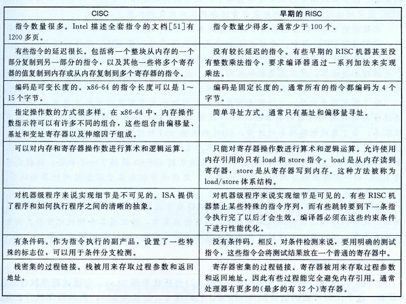
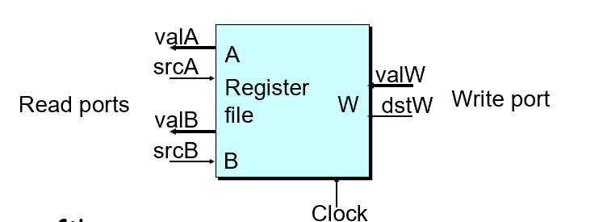

# CH4-Processor Architecture

## 4.1 Introducing to Y86

### Y86-64 Processor State

- **program registers**

  

  其中一个为空，这样就可以使用4个bits来表示寄存器

- **program counter**(也就是PC)
- **condition codes**(也就是CC:OF,ZF,SF)
- **status code**
  程序正常执行或发生事件
  分为：
  - 1(AOK):正常执行
  - 2(HLT):halt指令
  - 3(ADR):非法地址（取指或内存）
  - 4(INS):非法指令
- **memory**

### Y86-64 Instructions

一共有12条变长指令，通过其编号就可以判断其长度
格式：icode+ifun+rA+rB+valC


其中cmovXX是rrmovq的子集

- **Arithmetic and Logical Operations**
  这会设置CC

  ```assembly
  addq rA,rB    #ifun = 0
  subq rA,rB    #ifun = 1
  andq rA,rB    #ifun = 2
  xorq rA,rB    #ifun = 3
  ```

- **Move Operations**
  注意到这些指令都要通过寄存器作为媒介，所以会缺失一些x86的指令
- **Conditional Move Operations**
  其ifun类似于jXX，其中rrmovq对应的ifun = 0
- **Jump Instructions**

  ```assembly
  jmp Dest    #ifun = 0
  jle Dest    #ifun = 1
  jl  Dest    #ifun = 2
  je  Dest    #ifun = 3
  jne Dest    #ifun = 4
  jge Dest    #ifun = 5
  jg  Dest    #ifun = 6
  ```

- **Stack Operations**
  y86的栈基本类似于x86
  一些trick:

  ```assembly
  pushq %rsp -> save old %rsp
  popq %rsp -> movq (%rsp) %rsp
  ```

- **Subroutine Call and Return**
- **Miscellaneous Instructions**
  nop不做任何事情
  halt中止执行指令

### Y86-64 Programs

```assembly
1   # Execution begins at address 0
2 	.pos 0                          # assembler directives,告诉汇编器从地址0产生代码 
3 	irmovq	    stack, %rsp 	# Set up stack pointer,可以认为这里的stack类似于宏
4 	call     	    main 	# Execute main program
5 	halt 				# Terminate program
6
7   # Array of 4 elements
8 	.align 8                        # 同为伪指令，指出8字节对齐
9   array:                              # 声明一个数组
10 	.quad 0x000d000d000d
11 	.quad 0x00c000c000c0
12 	.quad 0x0b000b000b00
13 	.quad 0xa000a000a000
14
15   main:
16 	irmovq     array,%rdi
17 	irmovq     $4,%rsi
18 	call           sum 		# sum(array, 4)
19 	ret
20
```

```assembly
21   # long sum(long *start, long count)
22   # start in %rdi, count in %rsi
23   sum:
24 	irmovq     $8,%r8 		# Constant 8
25 	irmovq     $1,%r9 		# Constant 1
26 	xorq         %rax,%rax 		# sum = 0,相当于置零
27 	andq 	    %rsi,%rsi 		# Set CC,判断count是否为零，同时不改变其值
28 	jmp 	    test 		# Goto test
29   loop:
30 	mrmovq (%rdi),%r10		# Get *start
31 	addq %r10,%rax               	# Add to sum
32 	addq %r8,%rdi                	# start++
33 	subq %r9,%rsi                	# count--. Set CC
34   test:
35 	jne loop 			# Stop when 0
36 	ret 				# Return
37
38   # Stack starts here and grows to lower addresses
39   	.pos 0x200
40   stack:                             # 指明栈从0x200开始
```

通过观察每条指令执行后的状态码来debug

### ISA(Instruction Set Architecture)

ISA提供了软件与硬件之间的概念抽象层

#### CISC vs.RISC

RISC:ARM,CISC:X86



现在的ISA综合了CISC和RISC的优点

## 4.2 Logical Design & HCL

### Combinational Circuits

- **Bit Equal**
- **Bit-level Multiplexor(Bit MUX)**

#### HCL Representation

使用case expression表示,由多个select:expr组合而成，输出为第一个select为1的expr

```hcl
Out = [
   s : A;
   1 : B;
]
```

这里的1可以认为是default

- **Arithmetic Logic Unit**

### Storage(Sequential Circuits)

Clocked Registers
在clock呈现上升沿时，才根据input改变output

- **Register File**
  
  

  可同时支持读两个程序寄存器的值，同时更新第三个寄存器的状态
  - 读：根据src的寄存器ID，一段延迟后输出对应的val
  - 写：输入val和dst，在clock上升沿时写入

- **Memory**
  
  

  数据处理器
  类似的读与写，设置write为0或1，非法地址时，error设置为1

## 4.3 Sequential CPU Implementation

### Instruction Execution Stages


- **Fetch**
  读取指令
  因为PC是clock register，所以在上升沿的时候增加PC
- **Decode**
  读取register，使用register file
- **Execute**
  执行指令，ALU用于算术/逻辑单元，可能修改或使用CC
- **Memory**
  读写内存
- **Write Back**
  对寄存器进行写操作
- **PC**
  更新PC

当出现异常时（halt/非法指令/非法地址），processor loop停止

#### Computation Steps


具体的就看书吧

#### Values

- **Determinate Values**:
  *Fetch:* PC,icode,ifun,rA(寄存器编号),rB,valC(常量值),valP(增加后的PC值)
  *Decode:* valA(寄存器存的值),valB
  *Execute:* valE(ALU计算结果),CC,Cnd(之前的CC以判断情况)
  *Memory:* valM(内存值)
  *Write Back:* valE,valM
- **Indeterminate Values**:
  *Decode:* srcA(valA对应的位置,rA,%rsp),srcB(rB,%rsp)
  *Execute:* aluA(valA,valC,+8,-8),aluB(valB,0)
  *Memory:* addr(valA,valE),data(valA,valP)
  *Write Back:* dstE(rB,%rsp),dstM(rA,Cnd F)
  *PC:* newPC(valP,valC,valM)

上述步骤同时在上升沿发生，status同时更新

### SEQ CPU Implementation

<mark>待补充</mark>

## 4.4 Pipeline

### Principles of Pipeline

#### Limitations

1. 不均匀的划分：时钟周期必须等于最长阶段延迟加上寄存器延迟
2. 流水线过深，收益下降：每个阶段之间都要塞入流水线寄存器延迟，导致其占比大，单条指令延迟上升
3. 指令之间的依赖关系：数据依赖、控制依赖

### Pipeline Implemetation

#### Pipeline Stages

五级流水线：合并Fetch和PC(相当于PC被放在一开始，用于计算本条指令的位置而非下一条指令了)


整个硬件框图。实际上大部分内容与SEQ+相比，是相当类似或者说相同的。
变化有：

1. 信号的重新组织与命名。在原有输入信号前面加上流水线寄存器名称（大写）以区分各自用到的信号。因为例如icode就在Decode、Execute、Memory和Write back阶段都存在，而且这些信号的内容还不同(因为属于不同的指令)，所以用流水线寄存器来加以区分。D_icode, E_icode, M_icode, and W_icode.  
如果这些信号是某一阶段产生的，则以小写字母作前缀。例如valE是由Execute阶段产生的，所以在Execute阶段，他的名字叫e_valE.
2. 在Fetch阶段增加了Predict PC部件来预测下一条指令的地址。
3. 将valP和valA在Decode阶段合并为一个信号，所以多了一个Select A部件。书上P321。主要用处是减少控制信号和寄存器的数目。因为只有call指令会在memory阶段用到valP，只有jump指令会在execute阶段用到valP。这两种指令都不需要用到寄存器A。所以我们可以将这两个控制信号合并。这样，SEQ中的data部件就不需要了。因为在Fetch阶段本身就有Predict PC部件。这样valP在其他场合也不需要传播到Fetch阶段之外的场合去。

#### Hazards

**Predicting the PC:** 在上一条指令完成取指后开始猜测PC

- 大部分无控制指令：valP，总是能猜对
- call和无条件跳转：valC，总是能猜对
- conditional jumps：valC，可能猜错
- return指令：不用猜测
