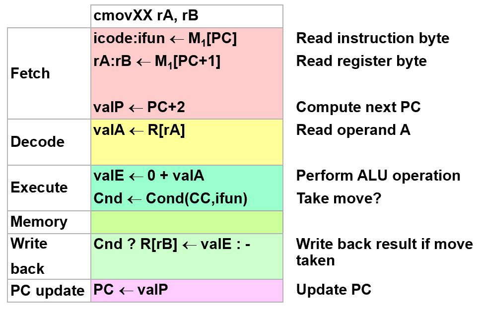
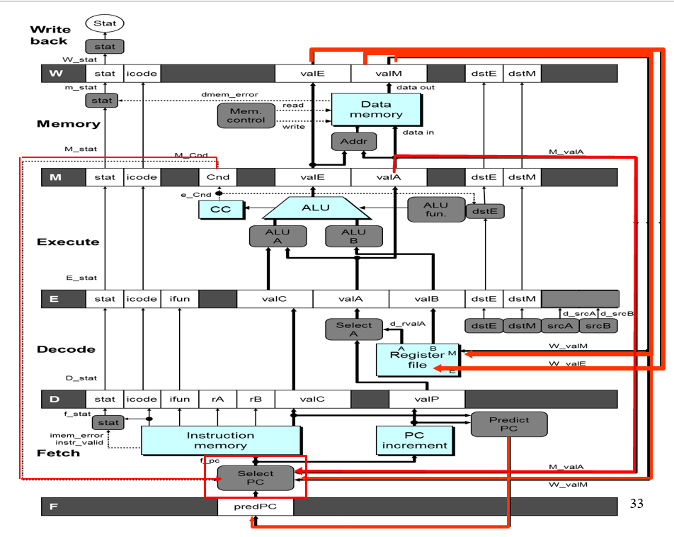
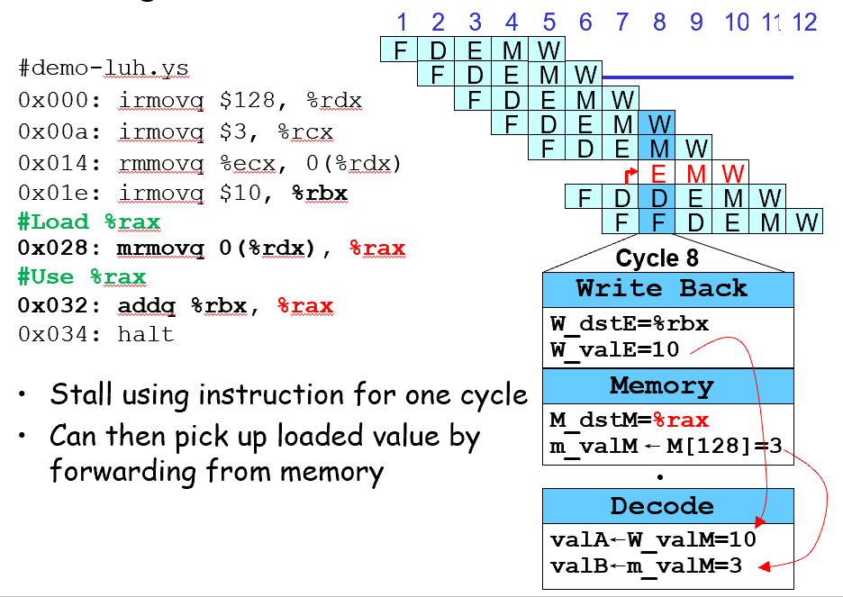
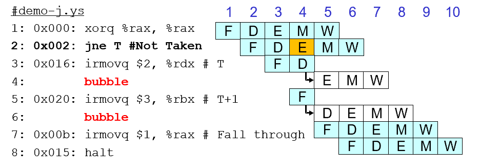
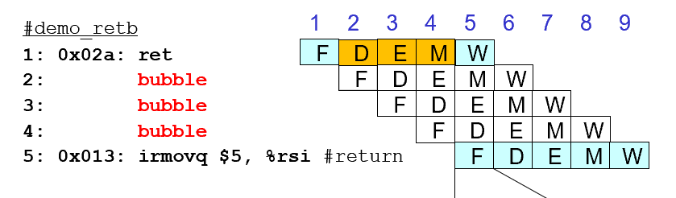
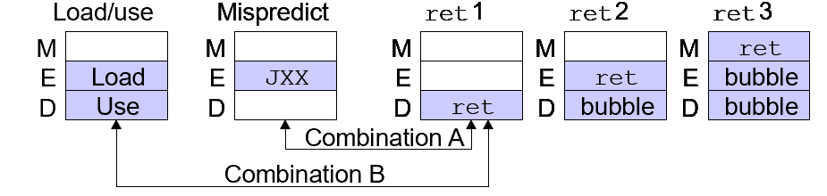

# CH4-Processor Architecture

## 4.1 Introducing to Y86

### Y86-64 Processor State

- **program registers**

  

  其中一个为空，这样就可以使用4个bits来表示寄存器

- **program counter**(也就是PC)
- **condition codes**(也就是CC:OF,ZF,SF)
- **status code**
  程序正常执行或发生事件
  分为：
  - 1(AOK):正常执行
  - 2(HLT):halt指令
  - 3(ADR):非法地址（取指或内存）
  - 4(INS):非法指令
- **memory**

### Y86-64 Instructions

一共有12条变长指令，通过其编号就可以判断其长度
格式：icode+ifun+rA+rB+valC


其中cmovXX是rrmovq的子集

- **Arithmetic and Logical Operations**
  这会设置CC

  ```assembly
  addq rA,rB    #ifun = 0
  subq rA,rB    #ifun = 1
  andq rA,rB    #ifun = 2
  xorq rA,rB    #ifun = 3
  ```

- **Move Operations**
  注意到这些指令都要通过寄存器作为媒介，所以会缺失一些x86的指令
- **Conditional Move Operations**
  其ifun类似于jXX，其中rrmovq对应的ifun = 0
- **Jump Instructions**

  ```assembly
  jmp Dest    #ifun = 0
  jle Dest    #ifun = 1
  jl  Dest    #ifun = 2
  je  Dest    #ifun = 3
  jne Dest    #ifun = 4
  jge Dest    #ifun = 5
  jg  Dest    #ifun = 6
  ```

- **Stack Operations**
  y86的栈基本类似于x86
  一些trick:

  ```assembly
  pushq %rsp -> save old %rsp
  popq %rsp -> movq (%rsp) %rsp
  ```

- **Subroutine Call and Return**
- **Miscellaneous Instructions**
  nop不做任何事情
  halt中止执行指令

### Y86-64 Programs

```assembly
1   # Execution begins at address 0
2 	.pos 0                          # assembler directives,告诉汇编器从地址0产生代码 
3 	irmovq	    stack, %rsp 	# Set up stack pointer,可以认为这里的stack类似于宏
4 	call     	    main 	# Execute main program
5 	halt 				# Terminate program
6
7   # Array of 4 elements
8 	.align 8                        # 同为伪指令，指出8字节对齐
9   array:                              # 声明一个数组
10 	.quad 0x000d000d000d
11 	.quad 0x00c000c000c0
12 	.quad 0x0b000b000b00
13 	.quad 0xa000a000a000
14
15   main:
16 	irmovq     array,%rdi
17 	irmovq     $4,%rsi
18 	call           sum 		# sum(array, 4)
19 	ret
20
```

```assembly
21   # long sum(long *start, long count)
22   # start in %rdi, count in %rsi
23   sum:
24 	irmovq     $8,%r8 		# Constant 8
25 	irmovq     $1,%r9 		# Constant 1
26 	xorq         %rax,%rax 		# sum = 0,相当于置零
27 	andq 	    %rsi,%rsi 		# Set CC,判断count是否为零，同时不改变其值
28 	jmp 	    test 		# Goto test
29   loop:
30 	mrmovq (%rdi),%r10		# Get *start
31 	addq %r10,%rax               	# Add to sum
32 	addq %r8,%rdi                	# start++
33 	subq %r9,%rsi                	# count--. Set CC
34   test:
35 	jne loop 			# Stop when 0
36 	ret 				# Return
37
38   # Stack starts here and grows to lower addresses
39   	.pos 0x200
40   stack:                             # 指明栈从0x200开始
```

通过观察每条指令执行后的状态码来debug

### ISA(Instruction Set Architecture)

ISA提供了软件与硬件之间的概念抽象层

#### CISC vs.RISC

RISC:ARM,CISC:X86


现在的ISA综合了CISC和RISC的优点

## 4.2 Logical Design & HCL

### Combinational Circuits

- **Bit Equal**
- **Bit-level Multiplexor(Bit MUX)**

#### HCL Representation

使用case expression表示,由多个select:expr组合而成，输出为第一个select为1的expr

```hcl
Out = [
   s : A;
   1 : B;
]
```

这里的1可以认为是default

- **Arithmetic Logic Unit**

### Storage(Sequential Circuits)

Clocked Registers
在clock呈现上升沿时，才根据input改变output

- **Register File**
  
  

  可同时支持读两个程序寄存器的值，同时更新第三个寄存器的状态
  - 读：根据src的寄存器ID，一段延迟后输出对应的val
  - 写：输入val和dst，在clock上升沿时写入

- **Memory**
  
  

  数据处理器
  类似的读与写，设置write为0或1，非法地址时，error设置为1

## 4.3 Sequential CPU Implementation

### Instruction Execution Stages


- **Fetch**
  读取指令
  因为PC是clock register，所以在上升沿的时候增加PC
- **Decode**
  读取register，使用register file
- **Execute**
  执行指令，ALU用于算术/逻辑单元，可能修改或使用CC
- **Memory**
  读写内存
- **Write Back**
  对寄存器进行写操作
- **PC**
  更新PC

当出现异常时（halt/非法指令/非法地址），processor loop停止

#### Computation Steps




具体的就看书吧

#### Values

- **Determinate Values**:
  *Fetch:* PC,icode,ifun,rA(寄存器编号),rB,valC(常量值),valP(增加后的PC值)
  *Decode:* valA(寄存器存的值),valB
  *Execute:* valE(ALU计算结果),CC,Cnd(之前的CC以判断情况)
  *Memory:* valM(内存值)
  *Write Back:* valE,valM
- **Indeterminate Values**:
  *Decode:* srcA(valA对应的位置,rA,%rsp),srcB(rB,%rsp)
  *Execute:* aluA(valA,valC,+8,-8),aluB(valB,0)
  *Memory:* addr(valA,valE),data(valA,valP)
  *Write Back:* dstE(rB,%rsp),dstM(rA,Cnd F)
  *PC:* newPC(valP,valC,valM)

上述步骤同时在上升沿发生，status同时更新

### SEQ CPU Implementation

## 4.4 Pipeline

### Principles of Pipeline

#### Limitations

1. 不均匀的划分：时钟周期必须等于最长阶段延迟加上寄存器延迟
2. 流水线过深，收益下降：每个阶段之间都要塞入流水线寄存器延迟，导致其占比大，单条指令延迟上升
3. 指令之间的依赖关系：数据依赖、控制依赖，这需要Hazard

### Pipeline Implemetation

#### Pipeline Stages

五级流水线：合并Fetch和PC(相当于PC被放在一开始，用于计算本条指令的位置而非下一条指令了)



整个硬件框图。实际上大部分内容与SEQ+相比，是相当类似或者说相同的。
变化有：

1. 信号的重新组织与命名。在原有输入信号前面加上流水线寄存器名称（大写）以区分各自用到的信号。因为例如icode就在Decode、Execute、Memory和Write back阶段都存在，而且这些信号的内容还不同(因为属于不同的指令)，所以用流水线寄存器来加以区分。D_icode, E_icode, M_icode, and W_icode.
  如果这些信号是某一阶段产生的，则以小写字母作前缀。例如valE是由Execute阶段产生的，所以在Execute阶段，他的名字叫e_valE.
2. 在Fetch阶段增加了Predict PC部件来预测下一条指令的地址。
3. 将valP和valA在Decode阶段合并为一个信号，所以多了一个Select A部件。书上P321。主要用处是减少控制信号和寄存器的数目。因为只有call指令会在memory阶段用到valP，只有jump指令会在execute阶段用到valP。这两种指令都不需要用到寄存器A。所以我们可以将这两个控制信号合并。这样，SEQ中的data部件就不需要了。因为在Fetch阶段本身就有Predict PC部件。这样valP在其他场合也不需要传播到Fetch阶段之外的场合去。

#### Predicting the PC

在上一条指令完成取指后开始猜测PC，使得马上执行下一条指令

- 大部分无控制指令：valP，总是能猜对
- call和无条件跳转：valC，总是能猜对
- conditional jumps：valC，可能猜错，使用Select PC判断正误，猜错了要进行补救
- return指令：无法猜测，使用Select PC得到正确的值

### Hazards

由于指令之间的依赖关系，需要进行冒险，记住主要的四个就可以(ret,mispredicting jmp,load/use,exception)

#### Data Hazard

##### Stalling

使用bubble插入nop，一次插入一个；bubble在时钟上升沿时让某条指令及其之后的指令停在原处不进入下一级，从而实现一个nop(即修改icode)，副作用是后面的指令都重复执行某个阶段。

##### Bypass Paths

在Decode阶段，需要取得valA和valB，这要么来源于register file，要么来源于forward，从接下来的阶段提前取得
*Forwarding Sources:*

- *Execute:* e_valE
- *Memory:* M_valE,m_valM
- *Write Back:* W_valE,W_valM

优先取最近的阶段，register file优先级最低
一般来说都可以forwarding，从而不需要stall和插入bubble，但也有可能来不及(即load/use)，此时只能使用一次stall来在Execute阶段插入一个bubble



#### Control Hazard

```hcl
int f_PC = [
#mispredicted branch. Fetch at incremented PC
    M_icode == IJXX && !M_Cnd : M_valA;
#completion of RET instruciton
    W_icode == IRET : W_valM;
#default: Use predicted value of PC
    1: F_predPC
];
```

一般来说都会选择TAKEN，即valP

##### Branch Misprediction

分别在Decode和Execute阶段插入两个bubble来及时阻止错误执行的两条指令，并把状态码改回来(所以会有M_Cnd写回的路径)



##### Return

下一条指令需要在fetch阶段stall并插入3个bubble，直到ret指令到达write back阶段，从而读到正确的W_valM
之所以没有在memory阶段就恢复，是因为pred PC在fetch最开始，而m_valM则是在memory阶段结尾获得的，这会使得fecth阶段耗时翻倍，影响流水线性能，后面jump使用M_valA也是这个原因(用大写)



#### Exceptions

在每个阶段都加入状态码来传递，在Write Back阶段再集中顺序处理异常

### PIPE CPU Implementation

#### PIPE Control Logic

##### Control Cases

- **Detection**: 
  | Condition | Trigger |
  | --- | --- |
  | Processing ret | IRET in { D_icode, E_icode, M_icode } |
  | Load/Use Hazard | E_icode in { IMRMOVL, IPOPL } && E_dstM in { d_srcA, d_srcB } |
  | Mispredicted Branch | E_icode = IJXX & !e_Cnd |
- **Action**:
  | Condition | F | D | E | M | W |
  | --- | --- | --- | --- | --- | --- |
  | Processing ret | stall | bubble | normal | normal | normal |
  | Load/Use Hazard | stall | stall | bubble | normal | normal |
  | Mispredicted Branch | normal | bubble | bubble | normal | normal |

##### Control Combinations



###### Combination A

jmp错误预测，此时也应当按照错误预测处理且stall在fetch，PC使用M_valA
| Condition | F | D | E | M | W |
  | --- | --- | --- | --- | --- | --- |
  | Processing ret | stall | bubble | normal | normal | normal |
  | Mispredicted Branch | normal | bubble | bubble | normal | normal |
  | Combination | stall | bubble | bubble | normal | normal |

###### Combination B

load的是%rsp，此时优先处理load/use，并将ret控制在decode阶段
| Condition | F | D | E | M | W |
  | --- | --- | --- | --- | --- | --- |
  | Processing ret | stall | bubble | normal | normal | normal |
  | Load/Use Hazard | stall | stall | bubble | normal | normal |
  | Combination | stall | stall + bubble | bubble | normal | normal |
  | Desired | stall | stall | bubble | normal | normal |

#### Performance Analysis

计算CPI，理想情况下1.0

#### HCL of PIPE CPU

```hcl
################ Fetch Stage     ###################################

## What address should instruction be fetched at
word f_pc = [
	# Mispredicted branch.  Fetch at incremented PC
	M_icode == IJXX && !M_Cnd : M_valA;
	# Completion of RET instruction
	W_icode == IRET : W_valM;
	# Default: Use predicted value of PC
	1 : F_predPC;
];

## Determine icode of fetched instruction
word f_icode = [
	imem_error : INOP;
	1: imem_icode;
];

# Determine ifun
word f_ifun = [
	imem_error : FNONE;
	1: imem_ifun;
];

# Is instruction valid?
bool instr_valid = f_icode in 
	{ INOP, IHALT, IRRMOVQ, IIRMOVQ, IRMMOVQ, IMRMOVQ,
	  IOPQ, IJXX, ICALL, IRET, IPUSHQ, IPOPQ, IIADDQ };

# Determine status code for fetched instruction
word f_stat = [
	imem_error: SADR;
	!instr_valid : SINS;
	f_icode == IHALT : SHLT;
	1 : SAOK;
];

# Does fetched instruction require a regid byte?
bool need_regids =
	f_icode in { IRRMOVQ, IOPQ, IPUSHQ, IPOPQ, 
		     IIRMOVQ, IRMMOVQ, IMRMOVQ, IIADDQ };

# Does fetched instruction require a constant word?
bool need_valC =
	f_icode in { IIRMOVQ, IRMMOVQ, IMRMOVQ, IJXX, ICALL, IIADDQ };

# Predict next value of PC
word f_predPC = [
	f_icode in { IJXX, ICALL } : f_valC;
	1 : f_valP;
];

################ Decode Stage ######################################


## What register should be used as the A source?
word d_srcA = [
	D_icode in { IRRMOVQ, IRMMOVQ, IOPQ, IPUSHQ  } : D_rA;
	D_icode in { IPOPQ, IRET } : RRSP;
	1 : RNONE; # Don't need register
];

## What register should be used as the B source?
word d_srcB = [
	D_icode in { IOPQ, IRMMOVQ, IMRMOVQ, IIADDQ  } : D_rB;
	D_icode in { IPUSHQ, IPOPQ, ICALL, IRET } : RRSP;
	1 : RNONE;  # Don't need register
];

## What register should be used as the E destination?
word d_dstE = [
	D_icode in { IRRMOVQ, IIRMOVQ, IOPQ, IIADDQ} : D_rB;
	D_icode in { IPUSHQ, IPOPQ, ICALL, IRET } : RRSP;
	1 : RNONE;  # Don't write any register
];

## What register should be used as the M destination?
word d_dstM = [
	D_icode in { IMRMOVQ, IPOPQ } : D_rA;
	1 : RNONE;  # Don't write any register
];

## What should be the A value?
## Forward into decode stage for valA
word d_valA = [
	D_icode in { ICALL, IJXX } : D_valP; # Use incremented PC
	d_srcA == e_dstE : e_valE;    # Forward valE from execute
	d_srcA == M_dstM : m_valM;    # Forward valM from memory
	d_srcA == M_dstE : M_valE;    # Forward valE from memory
	d_srcA == W_dstM : W_valM;    # Forward valM from write back
	d_srcA == W_dstE : W_valE;    # Forward valE from write back
	1 : d_rvalA;  # Use value read from register file
];

word d_valB = [
	d_srcB == e_dstE : e_valE;    # Forward valE from execute
	d_srcB == M_dstM : m_valM;    # Forward valM from memory
	d_srcB == M_dstE : M_valE;    # Forward valE from memory
	d_srcB == W_dstM : W_valM;    # Forward valM from write back
	d_srcB == W_dstE : W_valE;    # Forward valE from write back
	1 : d_rvalB;  # Use value read from register file
];

################ Execute Stage #####################################

## Select input A to ALU
word aluA = [
	E_icode in { IRRMOVQ, IOPQ } : E_valA;
	E_icode in { IIRMOVQ, IRMMOVQ, IMRMOVQ, IIADDQ } : E_valC;
	E_icode in { ICALL, IPUSHQ } : -8;
	E_icode in { IRET, IPOPQ } : 8;
	# Other instructions don't need ALU
];

## Select input B to ALU
word aluB = [
	E_icode in { IRMMOVQ, IMRMOVQ, IOPQ, ICALL, 
		     IPUSHQ, IRET, IPOPQ, IIADDQ } : E_valB;
	E_icode in { IRRMOVQ, IIRMOVQ } : 0;
	# Other instructions don't need ALU
];

## Set the ALU function
word alufun = [
	E_icode == IOPQ : E_ifun;
	1 : ALUADD;
];

## Should the condition codes be updated?
bool set_cc = E_icode == IOPQ || E_icode == IIADDQ &&
	# State changes only during normal operation
	!m_stat in { SADR, SINS, SHLT } && !W_stat in { SADR, SINS, SHLT };

## Generate valA in execute stage
word e_valA = E_valA;    # Pass valA through stage

## Set dstE to RNONE in event of not-taken conditional move
word e_dstE = [
	E_icode == IRRMOVQ && !e_Cnd : RNONE;
	1 : E_dstE;
];

################ Memory Stage ######################################

## Select memory address
word mem_addr = [
	M_icode in { IRMMOVQ, IPUSHQ, ICALL, IMRMOVQ } : M_valE;
	M_icode in { IPOPQ, IRET } : M_valA;
	# Other instructions don't need address
];

## Set read control signal
bool mem_read = M_icode in { IMRMOVQ, IPOPQ, IRET };

## Set write control signal
bool mem_write = M_icode in { IRMMOVQ, IPUSHQ, ICALL };

#/* $begin pipe-m_stat-hcl */
## Update the status
word m_stat = [
	dmem_error : SADR;
	1 : M_stat;
];
#/* $end pipe-m_stat-hcl */

## Set E port register ID
word w_dstE = W_dstE;

## Set E port value
word w_valE = W_valE;

## Set M port register ID
word w_dstM = W_dstM;

## Set M port value
word w_valM = W_valM;

## Update processor status
word Stat = [
	W_stat == SBUB : SAOK;
	1 : W_stat;
];

################ Pipeline Register Control #########################

# Should I stall or inject a bubble into Pipeline Register F?
# At most one of these can be true.
bool F_bubble = 0;
bool F_stall =
	# Conditions for a load/use hazard
	E_icode in { IMRMOVQ, IPOPQ } &&
	 E_dstM in { d_srcA, d_srcB } ||
	# Stalling at fetch while ret passes through pipeline
	IRET in { D_icode, E_icode, M_icode };

# Should I stall or inject a bubble into Pipeline Register D?
# At most one of these can be true.
bool D_stall = 
	# Conditions for a load/use hazard
	E_icode in { IMRMOVQ, IPOPQ } &&
	 E_dstM in { d_srcA, d_srcB };

bool D_bubble =
	# Mispredicted branch
	(E_icode == IJXX && !e_Cnd) ||
	# Stalling at fetch while ret passes through pipeline
	# but not condition for a load/use hazard
	!(E_icode in { IMRMOVQ, IPOPQ } && E_dstM in { d_srcA, d_srcB }) &&
	  IRET in { D_icode, E_icode, M_icode };

# Should I stall or inject a bubble into Pipeline Register E?
# At most one of these can be true.
bool E_stall = 0;
bool E_bubble =
	# Mispredicted branch
	(E_icode == IJXX && !e_Cnd) ||
	# Conditions for a load/use hazard
	E_icode in { IMRMOVQ, IPOPQ } &&
	 E_dstM in { d_srcA, d_srcB};

# Should I stall or inject a bubble into Pipeline Register M?
# At most one of these can be true.
bool M_stall = 0;
# Start injecting bubbles as soon as exception passes through memory stage
bool M_bubble = m_stat in { SADR, SINS, SHLT } || W_stat in { SADR, SINS, SHLT };

# Should I stall or inject a bubble into Pipeline Register W?
bool W_stall = W_stat in { SADR, SINS, SHLT };
bool W_bubble = 0;
#/* $end pipe-all-hcl */
```
