# CH5-Optimizing Program Performance

## 5.1 Machine-Independent Optimization

Cycles Per Element(CPE,每个元素的周期数):
$T = CPE * n + Overhead$

### Example 1

```c
void psum1(float a[],float p[],long n){
    long i;

    p[0] = a[0];
    for(i = 1;i < n,i++)
        p[i] = p[i - 1] + a[i];
}

void psum2(float a[],float p[],long n){
    long i;
    p[0] = a[0];
    for(i = 1;i < n - 1,i += 2){
        float mid_val = p[i - 1] + a[i];
        p[i] = mid_val;
        p[i + 1] = mid_val + a[i + 1];
    }
    /* For odd n, finish remaining element */
    if(i < n)
        p[i] = p[i - 1] + a[i];
}
```

此时psum2明显快于psum1，这是因为psum2平均每两步只访问内存2.5次，而psum1为3次（数组需要访问内存）

### Example 2

```c
typedef struct {
    long len ;
    data_t *data ;
 } vec_rec, *vec_ptr ;
 
typedef long data_t ;
 
/*
* Retrieve vector element and store at dest.
* Return 0 (out of bounds) or 1 (successful)
*/
int get_vec_element(vec_ptr v, long index, data_t *dest)
{
    if ( index < 0 || index >= v->len)
        return 0 ;
    *dest = v->data[index] ;
    return 1;
}
/* Return length of vector */
long vec_length(vec_ptr)
{
    return v->len ;
}
/* Return pointer to start of vector data */
data_t *get_vec_start(vec_ptr v)
{
    return v->data ;
}

void combine1(vec_ptr v, data_t *dest)
{
    long i;
    *dest = IDENT; //加法为0，乘法为1
    for (i = 0; i < vec_length(v); i++) {
            data_t val;
            get_vec_element(v, i, &val);
            *dest = *dest OP val;
  }
}
```

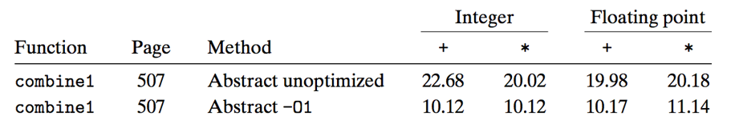

使用"-O1"可以得到一些基本的优化(编译器本身可以帮助优化，比如vec_length只有一行代码，因此编译器不会反复调用函数)，但是不同的运算和数据类型并没有显著差异，说明有比这更严重的情况需要优化。

#### Code Motion

```c
void combine2(vec_ptr v, data_t *dest)
{
    long i;
    long length = vec_length(v);
    
    *dest = IDENT;
    for (i = 0; i < length; i++) {
            data_t val;
            get_vec_element(v, i, &val);
            *dest = *dest OP val;
  }
}
```


虽然编译器优化了调用函数，但是每次调用ver_length，v->len都需要访问内存进行一次运算，同时v->len在整个loop中并没有发生变化，因此combine2优化为只进行一次v->len运算，从而优化了性能。此时不同运算和数据类型有了一定的差异。

##### More Examples

```c
void lower1(char *s){
    long i;

    for(i = 0;i < strlen(s); i++)
        if(s[i] >= 'A' && s[i] <= 'Z')
            s[i] -= ('A' - 'a');
}
```

```c
void lower2(char *s){
    long i;
    long len = strlen(s);

    for(i = 0;i < len; i++)
        if(s[i] >= 'A' && s[i] <= 'Z')
            s[i] -= ('A' - 'a');

size_t strlen(const char *s){
    long length = 0;
    while(*s != '\0'){
        s++;
        length++;
    }
    return length;
}
```

编译器没有能力知道strlen不变，因此它也无法优化(即编译器是在确保函数没有副作用时才会自己优化，其余时候必须程序员自己优化)；同时strlen时间复杂度为 $O(n)$ ，使得lower1的时间复杂度剧增为 $O(n^2)$ ，因此lower2的优化非常显著

#### Reduction in Strength

```c
void combine3(vec_ptr v, data_t *dest)
{
    long i;
    long length = vec_length(v);
    data_t *data = get_vec_start(v);

    *dest = IDENT;
    for ( i = 0 ; i < length ; i++ ) {
            *dest  = *dest OP data[i] ;
}
```

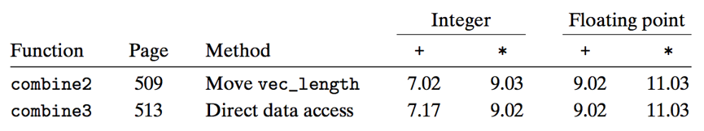

使用get_vec_start替代get_vec_element来减少过程调用，通过数组访问元素
遗憾的是，有其他瓶颈限制性能，甚至超过了get_vec_element的影响，导致性能没有明显优化

#### Eliminate Unneeded Memory References

检查汇编

```assembly
# combine3: data_t = double, OP = *
# data+length in %rax, data+i in %rdx, dest in %rbx
1 	.L17: 			   # loop:
2 	vmovsd 	(%rbx),  %xmm0 	       # Read product from dest
3 	vmulsd 	(%rdx), %xmm0,  %xmm0  # Multiply product by data[i]
4 	vmovsd 	%xmm0,  (%rbx) 	       # Store product at dest
5 	addq 	$8,  %rdx 	       # Increment data+i
6 	cmpq 	%rax,  %rdx 	       # Compare to data+length
7 	jne 	.L17 	               # If !=, goto loop
```

每次循环都需要通过%rbx访问内存得到*dest，但这个值就是上次循环得到的值，非常浪费；编译器不会优化，一方面编译器无法确保dest指向位置是否会变化，另一方面可能出现指针重叠

```c
void combine4(vec_ptr v, data_t *dest)
{
    long i;
    long length = vec_length(v);
    data_t *data = get_vec_start(v);
    data_t  acc = IDENT;
    for (i = 0; i < length; i++)
            acc = acc OP data[i];
    *dest = acc;
}
```

使用acc暂存*dest，而作为局部变量的acc会使用访问迅速的寄存器，从而优化不必要的内存访问。汇编如下：

```assembly
# combine4: data_t = double, OP = *
# data+length in %rax, data+i in %rdx, limit in %rbp, acc in %xmm0
1 	.L25: 			       # loop:
2 	vmulsd 	(%rdx), %xmm0, %xmm0       # Multiply acc by data[i]
3 	addq 	$8, %rdx 		   # Increment data+i
4 	cmpq 	%rax, %rdx 		   # Compare to data+length
5 	jne 	.L25 			   # If !=, goto loop
```


每次循环减少了一次访问内存和一次写入内存

### Optimizing Compilers

编译器会通过寄存器分配、代码选择与排序、消除小的低效率来进行优化；编译器不会优化复杂度；最大的问题是，会遇到编译器阻碍：内存别名(memory aliasing)和过程副作用(procedure side-effect)。

#### Optimization Blockers

##### Memory aliasing

```c
void twiddle1(int *xp, int *yp)
{
    *xp += *yp ;
    *xp += *yp ;
}

void twiddle2(int *xp, int *yp)
{
    *xp += 2* *yp ;
}
```

twiddle2只进行3次内存访问(读 *xp,读 *yp,写 *xp)，而twiddle1要进行6次(读 *xp2次,读 *yp2次,写 *xp2次)，优化了性能
但是当xp等于yp时，twiddle1会增加为原来的4倍，而twiddle2增加为原来的3倍

##### Function call and side effect

```c
    int counter = 0 ;
    int f(int x)
    {
        return counter++ ;
    }
    int func1(x)
    {
        return f(x)+f(x)+f(x)+f(x) ;
    }
    int func2(x)
    {
        return 4*f(x) ;
    }
```

注意func1调用函数4次，func2只调用1次，而函数有个副作用，即修改了全局变量，故func1返回0+1+2+3=6，func2返回4*0=0

##### Back to Example 2

v=[2,3,5]
combine3(v,get_vec_start(v)+2)
combine4(v,get_vec_start(v)+2)
此时会出现内存别名，故combine3开始就变成v=[2,3,1]，结果为v=[2,3,36]，而combine4答案为v=[2,3,30]

综上，在程序中常常会出现地址计算和内存存储，可能会引发上述的副作用，故应当多引入局部变量，既能在循环中见减少内存访问，提升性能，还能规避编译器检查内存别名

#### Limitations of Optimizing Compilers

编译器在优化程序时必须保证在任何情况下都不会改变程序行为；当程序行为较模糊时，编译器会采取更加保守的措施

## 5.2 Modern Processor

### Understanding Modern Processor

现代处理器从以下两个角度进一步优化性能：

- **超标量(Superscalar)**:将每一条指令进一步拆分成很多微操作，从而在每个时钟周期并行执行更多操作
- **乱序处理(Out-of-order execution)**:不按照指令顺序严格执行，如果没有依赖关系，可以打乱顺序来更好的并行执行

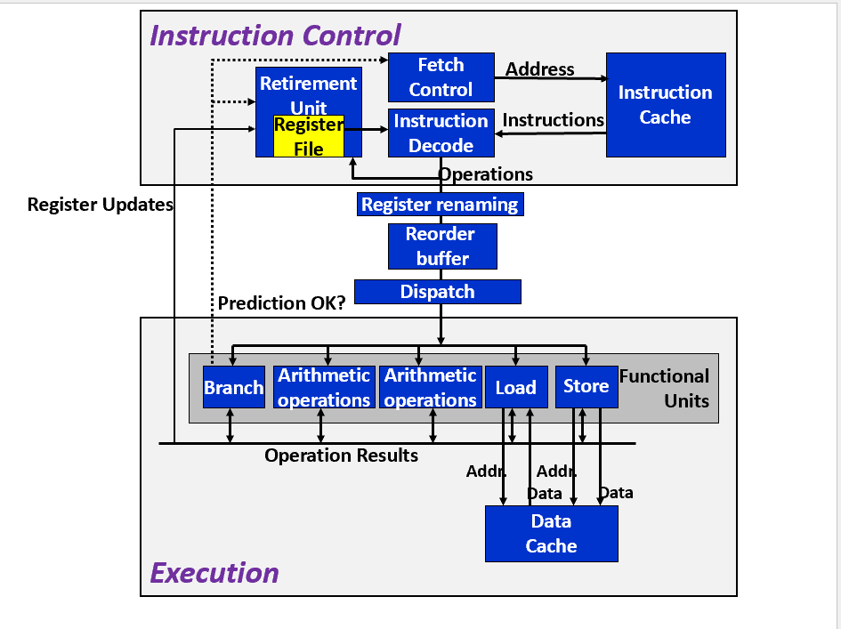

整个现代处理器包含两个部分：

- **ICU(Instruction Control Unit)**:对应原来的fetch,decode,write back
- **EU(Execution Unit)**:对应原来的execute,memory

介绍现代处理器的各个单元和流程：

- Fetch Control & instruction Cache:在执行指令很早以前就取指，并压入指令高速缓存，遇到分支时，进行分支预测，并提前进行fetch,decode，甚至execute(即Speculative Execute)，当发现预测错误时，倒退回分支点状态
- Instruction Decode:从指令高速缓存中取指，并将指令拆成多个微操作，如：
  
  ```assembly
  # Before
  addq %rax,8(%rdx)

  # After
  load 8(%rdx) -> t1
  addq %rax,t1 -> t2
  store t2,8(%rdx)
  ```

- Register Renaming:将寄存器和操作标记组成的键值对(r,t)记录到重命名表，从而对于变化的值，无需放入寄存器文件，就可以从一个操作转发到另一个操作，这也能规避分支预测错
误带来的副作用，如：
  
  ```assembly
  # Before
  .L25:		          # Loop:
  vmulsd (%rdx),%xmm0,%xmm0 # t *= data[i]
  addq $8, %rdx		  # Increment data+i
  cmpq %rax,%rdx		  # Comp to data+len
  jne .L25		  # if !=, goto Loop
  
  # After
  load (%rdx.0)       -> t.1
  mulq t.1, %xmm0.0   -> %xmm0.1
  addq $8, %rdx.0     -> %rdx.1
  cmpq %rax, %rdx.1   -> cc.1
  jne-taken cc.1
  ```

  %rax没有在loop中修改，故直接借助寄存器文件
- Retirement Unit:退役单元控制寄存器更新，当一条指令操作完成，且分支预测正确，指令退役，此时更新寄存器文件；如果分支预测错误，则清空(flushed)指令，从而规避预测错误带来的状态改变
- Multi-functional Units & Reorder buffer & Dispatch:操作被进一步细化，且多类操作可以并行执行，操作被乱序执行，并由dispatch分配具体单元，各个功能单元可以直接相互传递数据流
- Data Cache:存放最近访问的数据值，用于替代memory操作

#### More about Multi-functional Units

##### Multiple Instructions Can Execute in Parallel

以Haswell CPU为例，以下功能单元可以并行操作：

- Integer arithmetic(addition, bitwise operations, shifting), FP multiplication, integer and FP division, branches
- Integer arithmetic, FP addition, integer multiplication, FP multiplication
- Load, address computation
- Load, address computation
- Store
- Integer arithmetic
- Integer arithmetic, branches
- Store, address computation

##### Performance of Arithmetic Operations

衡量性能由以下三个指标刻画：

- **延迟(Latency)**:完成运算所需的总时间
- **发射时间(Issue)**:两个连续同类型运算之间需要的最小周期数(为1时，则完全流水线化)
- **容量(Capacity)**:能够执行该运算的功能单元数

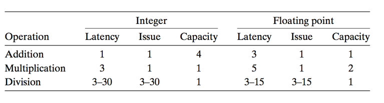

### Data-flow Graphs

重点需要留心图中的关键路径(critical path)，认为其是一组机器指令所需时钟周期数的下界
以combine4的loop为例：

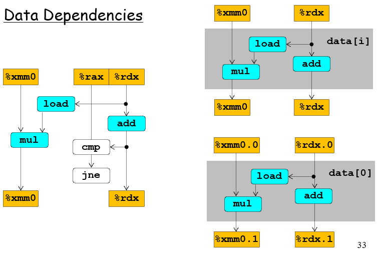

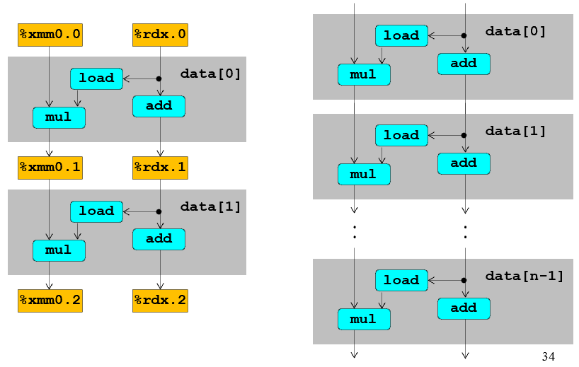

白色的方块和下一次loop没有构成数据传输关系，不纳入关键路径考虑，而青色方块则需要考虑进入关键路径。在本图中，mul的latency为5，add的latency为1，故影响性能的主要原因是x=x*data[i]，而不是i++(除了integer+，应认为是1+)

## 5.3 More Code Optimization

### Loop Unrolling

```c
void combine5(vec_ptr v, int *dest)
{
  int i;
  int length = vec_length(v);
  int limit = length - 1;
  data_t *data = get_vec_start(v);
  data_t acc = IDENT;
  /* combine 2 elements at a time */
  for (i = 0; i < limit; i+=2)
    acc = acc OPER data[i] OPER data[i+1];
  /* finish any remaining elements */
  for (; i < length; i++)
    acc = acc OPER data[i];
  *dest = acc ;
}
```

在combine5中，每次循环执行两次OP，即为2*1展开

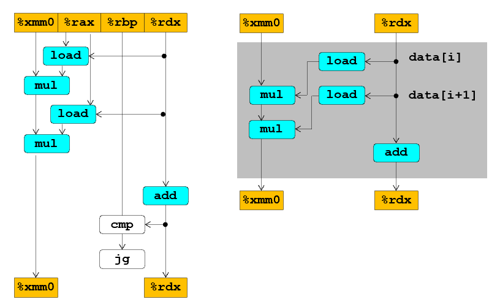

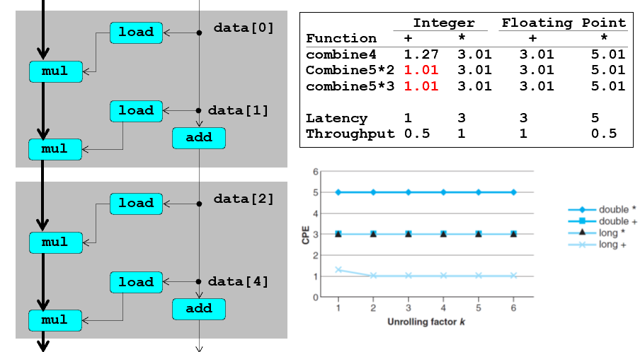

吞吐量(Throughput)给出了CPE的下界值，可以认为是$1/capacity$，对于整数加法，本应当是0.25，但load只有两个处理单元，其限制导致变成了0.50
按照5.1的知识，关键方块变少，性能理论上应当优化，但上述测试后发现并没有怎么优化。这是因为乘法是从左到右执行的，因此每组指令的乘法有依赖关系，无法分配到不同的容器，故没能优化（不过对整数加法有优化，尤其是展开次数上升后，这是因为i+=k的影响变小了）

### Enhance Parallelism

#### Multiple Accumulators


```c
void combine6(vec_ptr v, int *dest)
{
  int i;
  int length = vec_length(v), limit = length-1;
  data_t *data = get_vec_start(v);
  data_t acc0 = IDENT, acc1 = IDENT;
  /* combine 2 elements at a time */
  for (i = 0; i < limit; i+=2){
    acc0 = acc0 OPER data[i];
    acc1 = acc1 OPER data[i+1];
  }
  /* finish any remaining elements */
  for (; i < length; i++)
    acc0 = acc0 OPER data[i];
  *dest = acc0 OPER acc1;
}
```

将两次运算拆开来算，彼此之间没有依赖关系，loop结束后才算在一起放入dest中，提高了并行性，此时为2*2展开

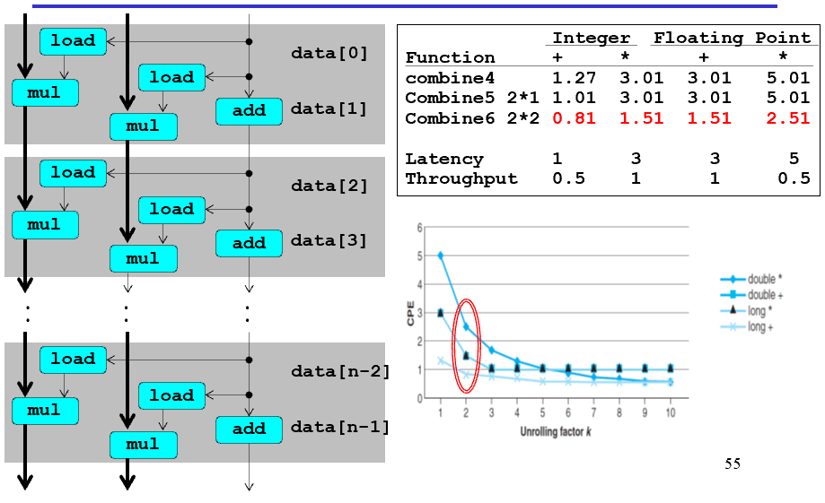

当并行因子(unrolling factor)k上升，CPE进一步下降，这是因为单条指令延迟不止为1，更多条指令并行，才更能充分利用容器，最后，当k足够大时，结果逼近吞吐量
注意整数乘法和浮点数加法的容器为1，但仍可以按照流水线实现计算（因为发射时间为1），故在取消部分依赖关系后依然可以优化（类似于前面提到的超标量）

#### Re-association Transformation

```c
void combine7(vec_ptr v, int *dest)
{
  int i;
  int length = vec_length(v), limit = length-1;
  data_t *data = get_vec_start(v);
  data_t acc = IDENT;
  /* combine 2 elements at a time */
  for (i = 0; i < limit; i+=2){
    acc = acc OPER (data[i] OPER data[i+1]);
  }
  /* finish any remaining elements */
  for (; i < length; i++)
    acc = acc OPER data[i];
  *dest = acc ;
}
```

虽然没有改变mul的依赖关系，但是两次乘法并不都是直接关联于%xmm的，因为add算的更快，数组乘法可以提前算好，所以只有括号外的乘法在关键路径上,认为是2*1a展开

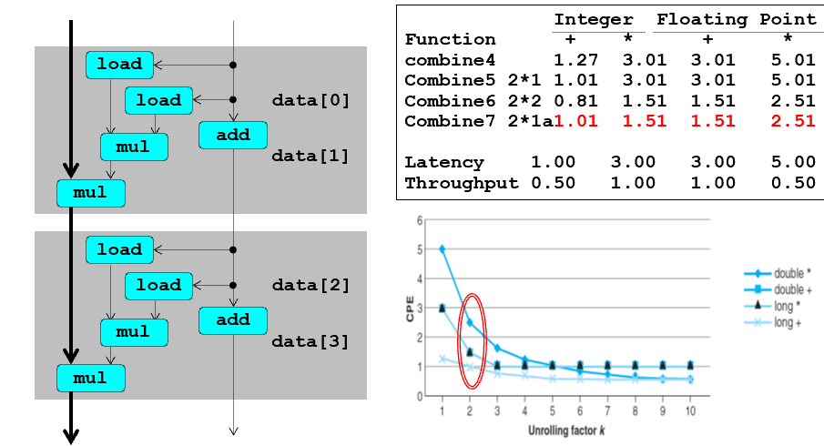

### Summary

#### Optimization Limiting Factors

- 寄存器溢出：当并行因子过大时，寄存器就会不够使用，此时只能访问和修改内存，反而使得性能下降
- 分支预测错误惩罚：编译器可以判断容易预测的分支，因此会带来巨大惩罚的往往是相对不好预测的分支，这是需要书写适合用条件数据传送实现的代码
  
  ```c
  void minmax1(int a[], int b[], int n)
  {
    int i;
    for (i = 0; i < n; i++) {
      if (a[i] > b[i]) {
        int t = a[i];
        a[i] = b[i];
        b[i] = t;
      }
    }
  } 

  void minmax2(int a[], int b[], int n)
  {
    int i;
    for (i = 0; i < n; i++) {
      int min = a[i]<b[i]?a[i]:b[i];
      int max = a[i]<b[i]?b[i]:a[i];
      a[i] = min;
      b[i] = max;
    }
  }
  ```

  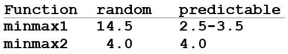

  其中minmax2容易使用cmov实现，带来的分支惩罚就会很小（因为不会影响取指，不必销毁大量操作）

## 5.4 Understanding Memory Performance

- **Load Performance**:认为load的latency为4.00，issue为1.00
- **Store Performance**:认为store的latency为2.00，issue为1.00

```c
void write_read(long *src, 
     long *dest, long n)
{
    long cnt = n;
    long val = 0;
    while (cnt) {
        *dest = val;
        val = (*src)+1;
        cnt--;
    }
}

write_read(&a[0],&a[1],3);  //Example A
write_read(&a[0],&a[0],3);  //Example B
```

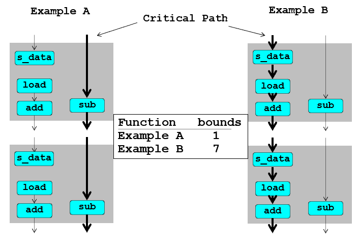
