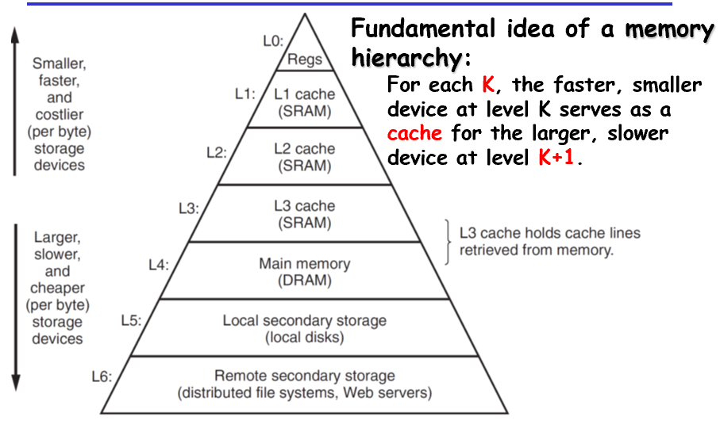
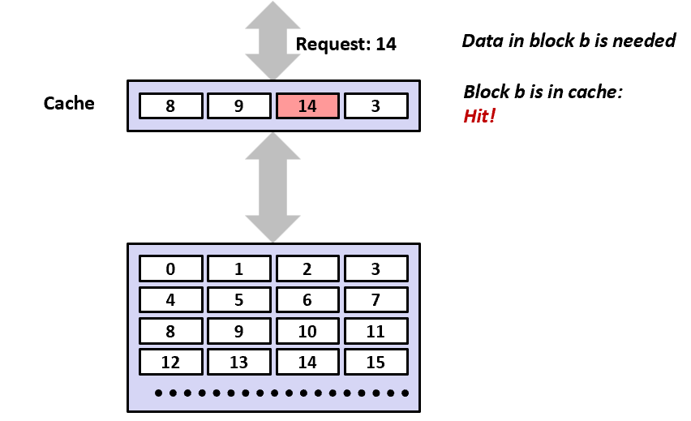
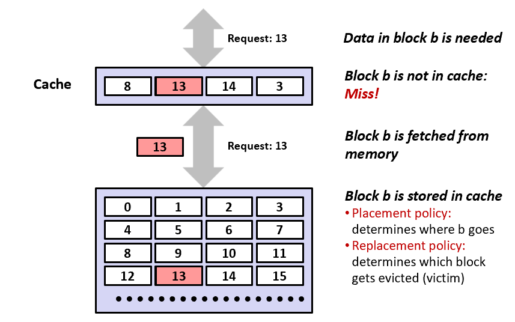
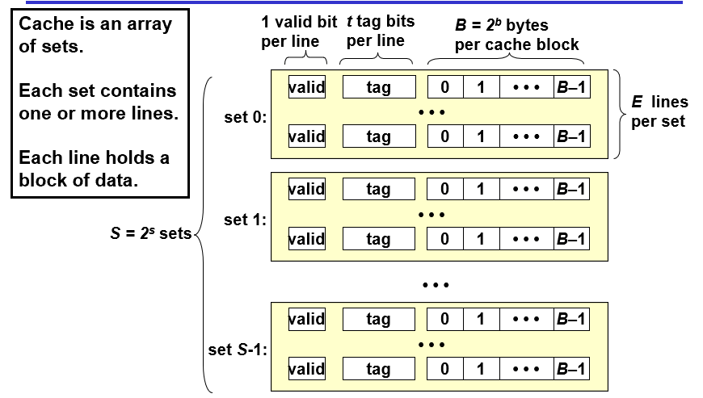
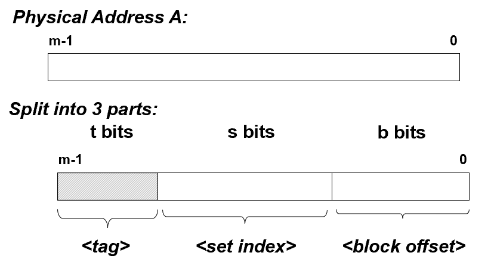
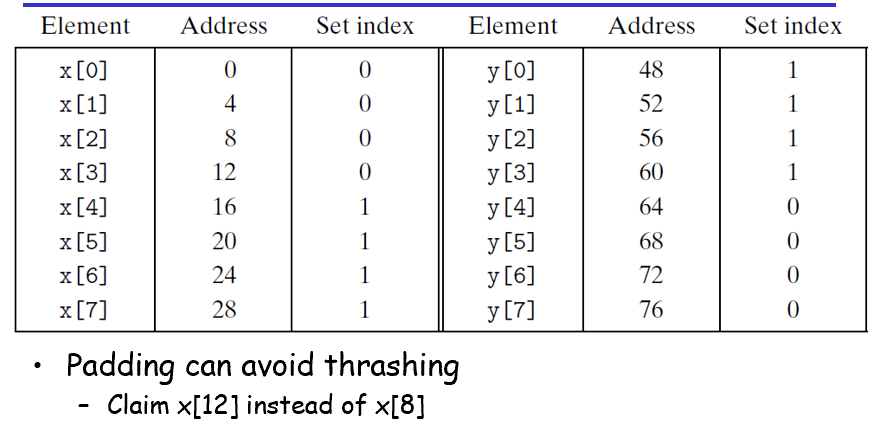
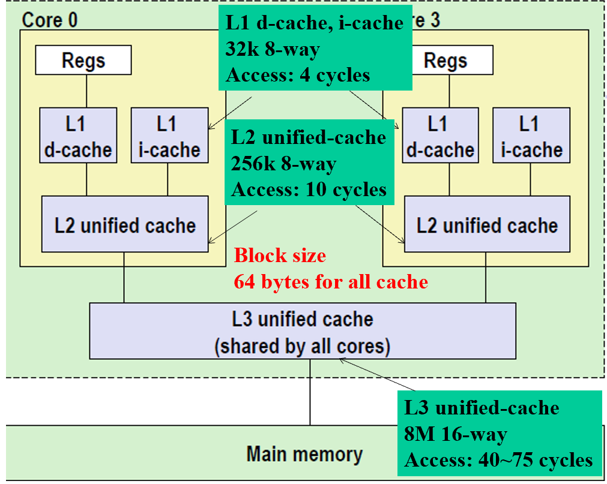
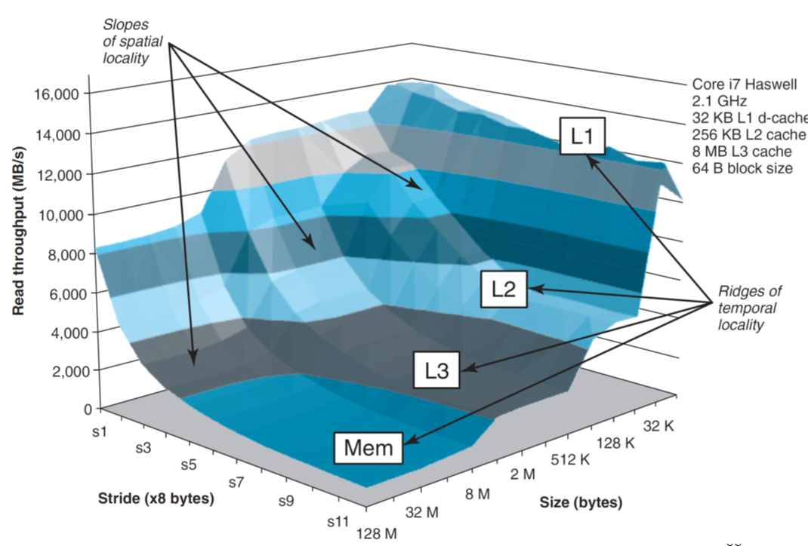
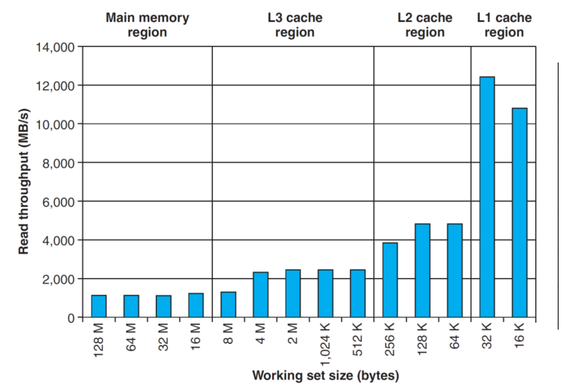
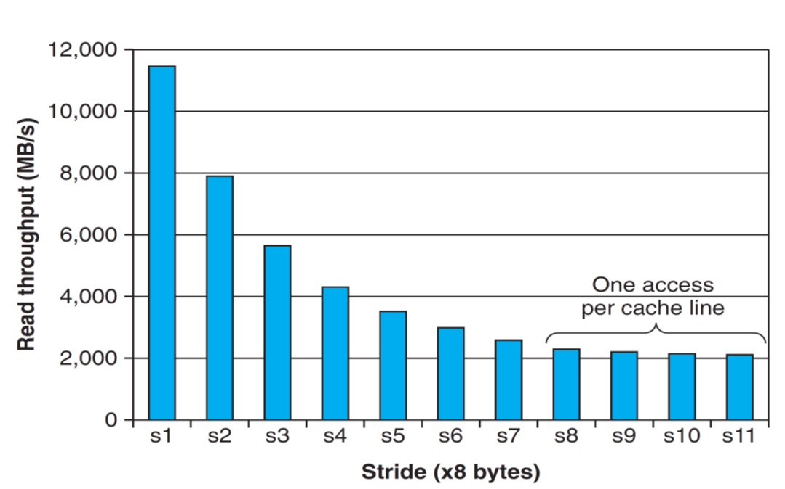

# Ch6-The Memory Hierarchy

## 6.1 RAM

## 6.2 Locality

- **temporal locality**:被引用过的数据在不久后还会再被多次引用
- **spatial locality**:一个内存位置被引用后，在不久后引用附近的内存位置

访问连续内存（控制步长），使用循环以多次使用同一条指令

## 6.3 Memory Hierarchy



缓存命中(cache hit):



缓存不命中(cache miss):



不命中类型有：

- **cold(compulsory) miss**:当cache为空时
- **capacity miss**:当工作集(working set)大于缓存
- **conflict miss**:访问的数据映射到了缓存中的同一位置

## 6.4 Cache Memory



| 参数 | 描述 |
| --- | --- |
| $S=2^s$ | 组数，使用s位来维护，描述组索引 |
| $E$ | 每一组的行数 |
| $B=2^b$ | 每个缓存块的字节大小，使用b位来描述块偏移量 |
| $m=log_2 (M)$ | 描述地址的数据的位数 |
| $t=m-(s+b)$ | 标记位位数 |
| $C=B*E*S$ | 不包括有效位和标记位的cache大小 |



### Direct-mapped cache

假设E=1

- **Set selection**:使用set index来定位是哪个组
- **line matching**:有效位必须被设置，而且tag必须是匹配的
- **word extraction**:根据block offset找到从块的哪个字节开始读

当缓存不命中时，需要从下一层取出块，并直接替换当前行。注意在这时，不一定只取访问数据，会把访问数据后面的数据也取了，直到填满该行的数据块大小
当来回访问映射到同一缓存位置的数据时，需要反复加载和驱逐相同的高速缓存块的组，称为thrash(抖动)
举例消除抖动：

```c
float dotprod(float x[8],float y[8]){
    float sum = 0.0;
    int i;
    for(i = 0; i < 8; i++)
        sum += x[i] * y[i];
    return sum;
}
```

假如x和y数组在内存连续，此时来回访问x[i]和y[i]，故反复发生抖动，优化方法是将x[8]变为x[12]：



使用中间位来当组索引，能让相邻的块映射到不同的行，减少冲突，同时块偏移量弥补了不用低位的问题

### Set associative caches

此时E>1

- **Set selection**
- **Line matching and word selection**：并行地寻找所有行中设置了有效位且标记匹配的行，此时命中

缓存未命中时，最优先替换空行，如果没有空行，则需要替换某一行，但都有开销，因此要减少缓存不命中：

- 随机替换
- LFU:替换最不常使用的行
- LRU:替换最近最少使用的行

### Fully associative caches

此时$E=C/B$

### Issues with Writes

- **Write hits**:写一个已经缓存的字，更新缓存中的副本后，还需要更新下一层的副本
  - **Write through**:立即写回下一层，但每次都引起总线流量
  - **Write back**:推迟更新，直到替换算法驱逐对应块时，减少了总线流量，但是复杂性增加，因为要维护标记是否被修改过的dirty bit
- **Write misses**:
  - **Write-allocate**:加载下一层的块到高速缓存中，再更新，利用了空间局部性，但是每次都要加载
  - **No-write-allocate**:直接写到下一层中

结合在一起，有Write through, no-write-allocate和Write back, write-allocate，后者更建议使用



其中i-cache(只读)只保存指令，d-cache只保存数据

### Cache performance metrics

- **Miss Rate**:$misses/references$
- **Hit Rate**:$1-missRate$，但使用miss rate更好
- **Hit Time**:cache传送一个字到CPU的时间，L1到core i7为4 cycles，L2到core i7为10 cycles
- **Miss Penalty**:不命中导致的额外时间，如L1不命中需要从L2得到服务的处罚为10 cycles，L3为50 cycles，memory为200 cycles

考虑以下因素：

- **Cache size**:Hit rate vs. hit time
- **Block size**:Spatial locality vs. temporal locality
- **Associativity**:即E的选择，thrashing,cost,speed,miss penalty
- **Write strategy**:Simple, read misses, fewer transfer

## 6.5 Writing Cache-Friendly Code

维护更好的局部性：

- 让更常见的情况运行得快：关注核心函数的循环
- 减少循环中的缓存不命中数量
- 反复引用局部变量
- 使用步长为1的引用模式

### Example(Matrix Multiplication)

```c
/* ijk (or jik)*/
for (i=0; i<n; i++)  {
  for (j=0; j<n; j++) {
    sum = 0.0;
    for (k=0; k<n; k++) 
      sum += a[i][k] * b[k][j];
    c[i][j] = sum;
  }
}
```

```c
/* kij (or ikj)*/
for (k=0; k<n; k++) {
  for (i=0; i<n; i++) {
    r = a[i][k];
    for (j=0; j<n; j++)
      c[i][j] += r * b[k][j];   
  }
}
```

```c
/* jki (or kji)*/
for (j=0; j<n; j++) {
  for (k=0; k<n; k++) {
    r = b[k][j];
    for (i=0; i<n; i++)
      c[i][j] += a[i][k] * r;
  }
}
```

| 版本 | load | store | A未命中 | B未命中 | C未命中 | sum |
| --- | --- | --- | --- | --- | --- | --- |
| ijk (or jik) | 2 | 0 | 0.25(横读矩阵，步长为1) | 1.0(纵读矩阵，必冲突) | 0.0(每次循环只单个点) | 1.25 |
| kij (or ikj) | 2 | 1 | 0.0(每次循环只单个点) | 0.25(横读矩阵，步长为1) | 0.25(横读矩阵，步长为1) | 0.5 |
| jki (or kji) | 2 | 1 | 1.0(纵读矩阵，必冲突) | 0.0(每次循环只单个点) | 1.0(纵读矩阵，必冲突) | 2.0 |

硬件有能力识别步长为1的访问，并给出奖励，使得数组长度增加后，周期/迭代变化很小

## 6.6 The Memory Mountain

**Read throughput (read bandwidth)**:程序从存储系统中读取数据的速率

```c
long data[MAXELEMS];
/* Run test (elems, stride) and return read throughput (MB/s) */
double run (int size, int stride, double Mhz)
{
    double cycles;
    int elems = size / sizeof(long); 

    test (elems, stride);                     	/* warm up the cache */
    cycles = fcyc2(test, elems, stride, 0);  	/* call test (elems,stride) */
    return (size / stride) / (cycles / Mhz); 	/* convert cycles to MB/s */
}
```

```c
/* The test function */
int test (int elems, int stride) {
    long i, sx2=stride*2, sx3=stride*3, sx4=stride*4 ;
    long acc0 = 0, acc1 = 0, acc2 = 0, acc3 =0; 
    long length = elems;
    long limit = length – sx4 ;
    /*Combine 4 elements at a time*/
    for (i = 0; i < limit; i += sx4) {
        acc0 += data[i];
        acc1 += data[i+stride];
        acc2 += data[i+sx2];
        acc3 += data[i+sx3];
    }
    for (; i  < length; i+=stride) 
       acc0 += data[i]
    return ((acc0+acc1)+(acc2+acc3)) ;
}
```

调整size和stride来分别改变时间和空间局部性，从而得到存储器山



当stride=8时，改变size，观察由哪一级缓存来服务：



当size=4M时，改变stride，步长小事，由L2服务，不命中率上升，当stride>=8时，L2必不命中，直接由L3服务，故变为常数：



上述均为存储器山的切面。优先让写的程序在山峰，即频繁使用的字从L1取得，并让尽可能多的字能直接从L1中访问得到
