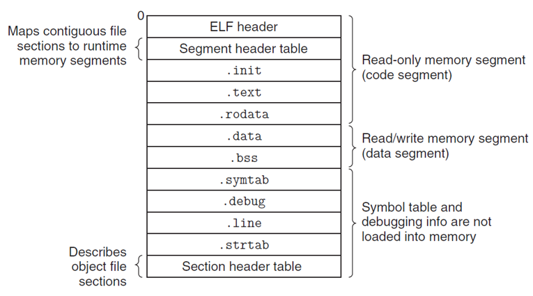

# CH7-Linking

## 7.1-4 Linking

### Static Linking

Linker需要进行symbol resolution和relocation

### Relocatable Object Files

这里需要说明目标文件的形式，可重定位目标文件在编译时和其他可重定位目标文件合并在一起，形成可执行目标文件，这样就可以直接复制到内存中执行，而共享目标文件可以被动态地加载进内存并链接
现代Linux系统使用ELF格式的可执行文件，包含了一系列数据节(section)
对于外部引用，会初始化为0，在符号解析时会将符号引用和符号关联起来，而重定位会将符号和内存位置关联起来，覆盖掉编译器暂定的0，生成可执行目标文件

### ELF


上述是一个ELF可重定位目标文件，ELF头用于描述一些文件基本信息；节头部表描述不同节的位置和大小；剩下的是一下具体的section:

- .text:已编译程序的机器码
- .rodata:只读的数据，提升鲁棒性
- .data:已初始化的全局和静态C变量
- .bss:未初始化的全局和静态C变量(或者初始化为0)，实际不会占据空间，仅生成占位符
- .symtab:符号表，存放函数和全局变量的信息
- .rel.text
- .rel.data
- .debug
- .line:和前一个共同用于调试
- .strtab:字符串表，包括节名字等，以null结尾

## 7.5-6 Symbol Table

符号表维护三种不同的符号：

- defined global symbols:由该模块定义并能被其他模块引用，即非静态的C函数和全局变量
- referenced global symbols:其他模块定义并被该模块引用的符号
- local symbols:不被其他模块引用，即静态C函数和全局变量

注意不包含被栈维护的本地非静态程序变量


以swap.c为例

```c
extern int buf[];

int *bufp0 = &buf[0];
static int *bufp1;

static void incr()
{
    static int count=0;
    count++;
}
 void swap()
{
    int temp;

    incr();
    bufp1 = &buf[1];
    temp = *bufp0;
    *bufp0 = *bufp1;
    *bufp1 = temp;
}
```


每个符号被分配到目标文件的某个节中，除了三个伪节(pseudosections)：ABS(不该被重定位的符号),UNDEF(未定义的符号),COMMON(违背分配位置的未初始化的数据目标)，与.bss的区别在于，COMMON是未初始化的全局变量，.bss是未初始化的静态变量和初始化为零的全局或静态变量
<mark>GNU READELF能帮你打印目标文件内容</mark>

### Multiply Defined Global Symbols

每个全局变量或强或弱：

- strong:函数和以初始化的全局变量
- weak:未初始化的全局变量

对于多重定义的全局变量，规则如下：

- 不允许多个同名的强符号
- 若一个强符号和多个弱符号同名，选择强符号
- 多个弱符号同名，随机选择一个

对于下面的例子，选择了强符号int(4字节)，但是对x赋值为-0.0(8字节)时，会覆写x和y的值

```c
/*foo5.c*/
#include <stdio.h>
void f();
int x = 15213;
int y = 15212;
int main(){
    f();
    printf((“x=0x%x y=0x%x \n”, x, y);
    return 0;
}

/*bar5.c*/
double x;
void f(){
    x = -0.0;
}
```

### Linking with Static Libraries

使用静态库来实现，将相关函数编译成独立的小的目标模块，再封装成单独的静态库文件，这个时候链接器就只会复制程序引用的少量目标模块，节省空间


## 7.7-9 Relocation and Loading

### Relocation

在符号解析之后，将代码的每个符号唯一地和符号定义关联起来，从而确定了输入目标模块的代码节和数据节的确切大小，并进行重定位，分为两步：重定位节和符号大小(将所有相同类型的节合并为一个新的聚合节，并完成内存地址的赋值)；重定位节中的符号引用(修改引用这些符号，使它们不再为零，需要借助relocation entry)
对于目标模块中无法确定最终位置的目标引用，会在.rel.data和.rel.text中维护，其中包含重定位类型，具体可通过汇编是相对的还是绝对的引用来判断：

- **R_X86_64_PC32**:32位的相对引用
- **R_X86_64_64**:绝对引用地址

对于一个重定位条目，形式为:

```shell
offset symbol type addend
```

offset为偏移量，这个对应汇编中的位置；symbol是引用的还没有确定的符号；type就是前面说的那两个；addend为一个符号常数，用于偏移调整，后面会给出计算时它发挥的作用

具体计算可以看这两个例子，首先是相对地址：


下面是绝对地址计算：


根据下面这个例子来学习addend和type的判断：


### Executable Object Files

可执行目标文件的ELF形式和可重定位目标文件有所不同：



因为已经完全链接，不存在.rel节了，.init节用于初始化，段头部表用于将连续的文件节映射到运行时的内存段中

### Loading

加载器(Loader)将可执行目标文件中的代码和数据从磁盘复制到内存中，跳转到入口点来运行程序，即将可执行文件的片(chunk)复制到代码段和数据段，跳转到_start的地址

## 7.10-12 Dynamic Link

静态库的内容更新后，使用库的程序员需要显式重新编译以期和新版本的静态库链接，这就很麻烦；还有就是即使只有小的函数模块，也因为进程数太多导致内存空间的浪费
使用shared library来解决这个问题，后缀为```.so```，在微软中称为DLL；使用动态链接器实现在运行或加载时再加载到任意内存地址，实现与内存中的程序的链接


会注意到动态库的代码和数据节不会被复制到可执行文件中去，而是复制一些重定位和符号表的信息，后面运行时(running time)再将动态库中的文本和数据重定位到内存段中，并重定位可执行文件的引用
在running time再进行linking有一些实际的例子，如分发软件和构建高性能web服务器

### Position-Independent Code (PIC)

共享库还有一个好处就是让多个进程共享内存中相同的库代码，因此引入了位置无关代码，其可以加载但不需要重定位。对于同一模块内部，使用PC相对寻址就可以编译这些引用，用静态链接重定位；而共享模块就需要对外部过程和全局变量特殊处理

#### PIC Data References

注意任意模块的数据段和代码段距离保持不变，为一个常量
因此在数据段开始部分创建了一个GOT表(全局偏移量表)，其中每个被这个目标模块引用的全局数据目标都有一个8字节的条目，每个引用全局目标的目标模块都有自己的GOT.看看怎么利用了代码段和数据段的距离不变性的：


#### PIC Function Calls

使用lazy binding(延迟绑定)将过程地址的绑定推迟到第一次调用这个函数时，这样的好处是只有极少数真正被调用的函数才会被重定位，其借助了两个数据结构来实现：GOT和PLT(过程链接表)，分别处于.data和。text中
第一次调用步骤如下：

- 进入PLT中对应的条目，例子中addvec对应PLT[2]
- 第一条PLT指令通过GOT[4]来进行间接跳转，注意每个GOT条目初始时都指向其对应的PLT条目的第二条指令，故只是来到了PLT[2]的下一条指令
- 把addvec的ID(0x1)压入栈中后，jmp指令让其来到了PLT[0]
- PLT[0]通过GOT[1]间接把动态链接器的一个参数压入栈中，再通过GOT[2]跳转到动态链接器中，动态链接器使用两个栈条目确定了addvec的运行时位置，重写GOT[4]为该地址，再把控制传递给addvec

后续调用addvec就不一样了：

- 控制传递到PLT[2]
- GOT[4]间接跳转使得控制直接来到addvec中


