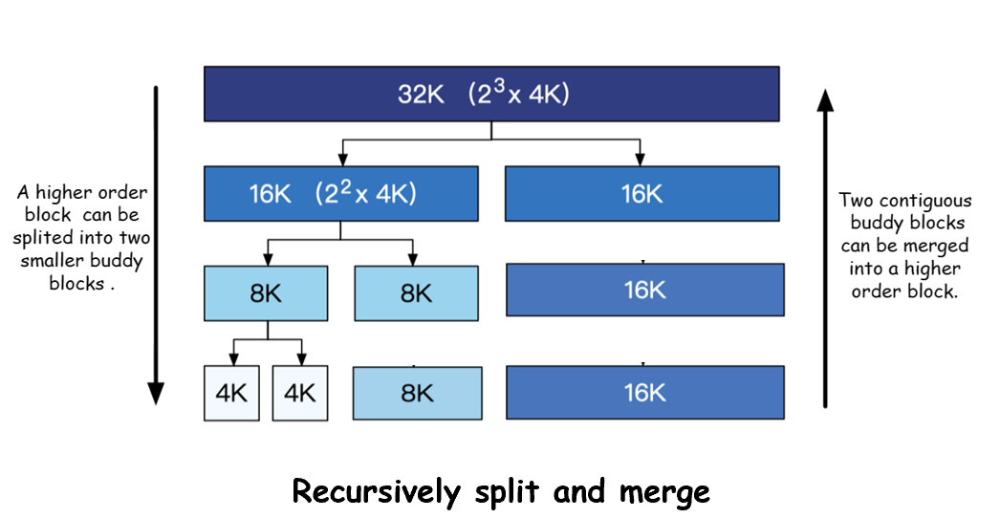
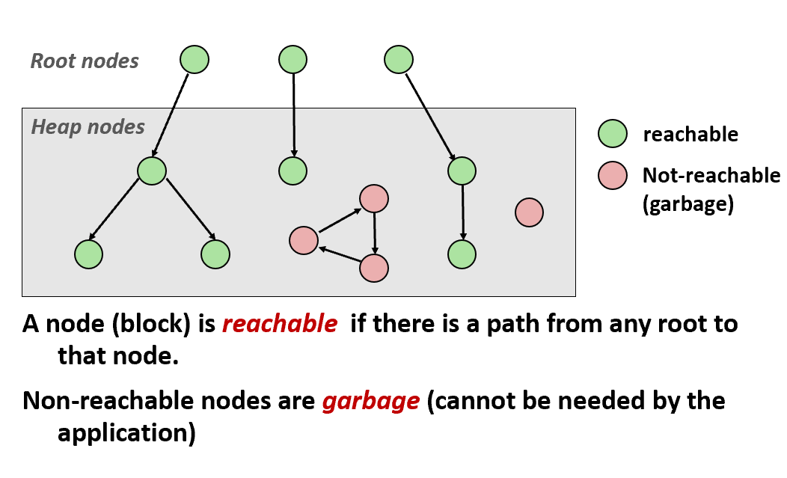
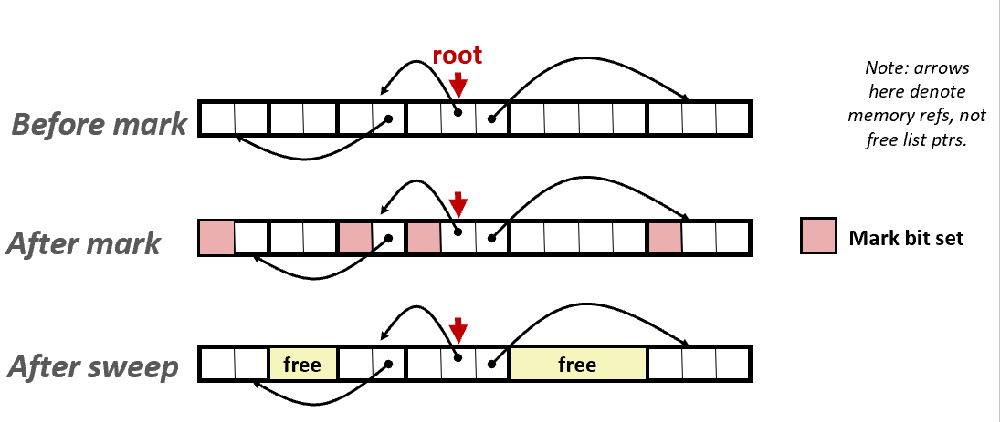

# CH9-Virtual Memory

## 9.9 Dynamic Memory Allocation

### Malloc-Related Interfaces

```c
#include <stdlib>
void *malloc(size_t size);
```

分配成功时返回8字节对齐的内存块；当size==0时返回NULL；分配失败则返回NULL的同时，设置errno为ENOMEM

```c
#include <stdlib>
void free(void *p);
```

释放对应的内存块，但指针p必须是由malloc,calloc,realloc分配的

```c
#include <unistd.h>
void *sbrk(int incr);
```

sbrk函数通过修改堆顶指针brk来扩展和收缩堆。成功，则返回brk的旧值；失败，则返回-1；当incr==0时，返回当前值；incr可为负数，此时收缩堆


### Allocator Requirements

- 能处理任意请求序列：不能提前假设
- 立刻响应请求：不能缓冲
- 只使用堆
- 8字节对齐块
- 不修改已经分配的块

优化目标：

- **throughput(最大化吞吐率)**：每个单位时间完成的请求数
- **peak memory utilization(峰值利用率)**：认为有效载荷(payload)p为请求的块大小，聚合有效载荷(aggregate payload)$P_k$为已分配块的有效载荷之和，堆的当前大小为$H_k$，则$U_k = (max_{i<=k}P_i)/H_k$

#### Fragmentation

碎片导致低利用率，分为内部碎片和外部碎片

- **Internal Fragmentation**:当已分配块大于有效载荷时产生，如维护堆时产生的开销，对齐时产生的填充，显式规则等，这是很好衡量的
- **External Fragmentation**:当堆的剩余空间足够，但没有单独的空闲块足够时发生，难以衡量

### Implementation Issues and Solutions

#### Knowing how Much to Free(How do we know how much memory to free just given a pointer?)

每个块都使用头部维护块的大小，注意此时的size是要加上这个4字节的头部的，而非有效载荷，同时应当是有效载荷对齐8字节，而非头部，且指针指向的也是有效载荷

#### Implicit List(How do we keep track of the free blocks?)

使用额外的比特维护块是否空闲，需要3个比特，这样size就会被乘以8，这样就产生了隐式空闲链表


#### Finding a Free Block(How do we pick a block to use for allocation?)

- **First fit(首次适配)**：从头开始搜索合适的空闲块，使得大的空闲块集中在链表后面，但会使链表起始处产生小的空闲块碎片
- **Next fit(下一次适配)**：从上一次查询结束的位置开始检查，但内存利用率比首次适配低很多
- **Best fit(最佳适配)**：遍历整个链表，选择所有空闲块中最适合的，碎片少但用时多

#### Allocating in a free block(How to deal with the extra space?)

将空闲块分割成分配块和新的空闲块

#### Freeing a block(How do we reinsert freed block?)


- **Coalescing(合并)**：释放的空闲块需要与前后的空闲块合并，但在合并前面的空闲块时，难以判断哪个字才是头部
- **Bidirectional Coalescing(双向合并)**：需要使用边界标记(boundary tags)，在块的尾部也需要维护块大小和是否空闲，形成双向链表，头部尾部连续使得可以确定前后块的确切位置


接下来合并分为四种情况，处理如图：

### A Basic Implementation

接下来需要实现一个简单的分配器，提供三个接口：

```c
int mm_init(void);
void *mm_malloc(size_t size);
void mm_free(void *bp);
```


宏定义：

```c
/* Basic constants and macros */
#define WSIZE 4 /* word size (bytes) */
#define DSIZE 8 /* double word size (bytes) */
#define CHUNKSIZE (1<<12) /* Extend heap by this amount (bytes) */

#define MAX(x, y) ((x) > (y)? (x) : (y))

/* Pack a size and allocated bit into a word */
#define PACK(size, alloc) ((size) | (alloc))

/* Read and write a word at address p */
#define GET(p) (*(unsigned int *)(p))
#define PUT(p, val) (*(unsigned int *)(p) = (val))

/* Read the size and allocated fields from address p */
#define GET_SIZE(p) (GET(p) & ˜0x7)
#define GET_ALLOC(p) (GET(p) & 0x1)

/* Given block ptr bp, compute address of its header and footer */
#define HDRP(bp) ((char *)(bp) - WSIZE)
#define FTRP(bp) ((char *)(bp) + GET_SIZE(HDRP(bp)) - DSIZE)

/* Given block ptr bp, compute address of next and previous blocks */
#define NEXT_BLKP(bp) ((char *)(bp) +GET_SIZE(((char *)(bp)-WSIZE)))
#define PREV_BLKP(bp) ((char *)(bp) - GET_SIZE(((char *)(bp) - DSIZE)))
```

```c
int mm_init(void)
{
/* create the initial empty heap */
    if ((heap_listp = mem_sbrk(4*WSIZE)) == (void *) -1)
        return -1;
    PUT(heap_listp, 0);                         /* alignment padding */
    PUT(heap_listp+(1*WSIZE), PACK(DSIZE, 1));  /* prologue header */
    PUT(heap_listp+(2*WSIZE), PACK(DSIZE, 1));  /* prologue footer */
    PUT(heap_listp+(3*WSIZE), PACK(0, 1));      /* epilogue header */
    heap_listp += (2*WIZE);

    /* Extend the empty heap with a free block of CHUNKSIZE bytes */
    if (extend_heap(CHUNKSIZE/WSIZE) == NULL)
        return -1;
    return 0;
}
```

这里传给内置函数extent_heap的参数为字的数目，故需要先检查是否能8对齐（也就是参数是否为偶数），mem_sbrk返回的值为旧的brk，也就是旧堆的结尾，即新堆的有效载荷的起始位置

```c
static void *extend_heap(size_t words)
{
    char *bp;
    size_t size;

    /* Allocate an even number of words to maintain alignment */
    size = (words % 2) ? (words+1) * WSIZE : words * WSIZE;
    if ((long)(bp = mem_sbrk(size))  == -1)
        return NULL;

    /* Initialize free block header/footer and the epilogue header */
    PUT(HDRP(bp), PACK(size, 0));               /* free block header */
    PUT(FTRP(bp), PACK(size, 0));               /* free block footer */
    PUT(HDRP(NEXT_BLKP(bp)), PACK(0, 1));       /* new epilogue header */

    /* Coalesce if the previous block was free */
    return coalesce(bp);
}
```

```c
void mm_free(void *bp)
{
    size_t size = GET_SIZE(HDRP(bp));

    PUT(HDRP(bp), PACK(size, 0));
    PUT(FTRP(bp), PACK(size, 0));
    coalesce(bp);
}
```

```c
static void *coalesce(void *bp)
{
    size_t prev_alloc = GET_ALLOC(FTRP(PREV_BLKP(bp)));
    size_t next_alloc = GET_ALLOC(HDRP(NEXT_BLKP(bp)));
    size_t size = GET_SIZE(HDRP(bp));

    if (prev_alloc && next_alloc) {         /* Case 1 */
        return bp;
    }

    else if (prev_alloc && !next_alloc) {   /* Case 2 */
        size += GET_SIZE(HDRP(NEXT_BLKP(bp)));
        PUT(HDRP(bp), PACK(size, 0));
        PUT(FTRP(bp), PACK(size,0));
        return(bp);
    }
    else if (!prev_alloc && next_alloc) {   /* Case 3 */
        size += GET_SIZE(HDRP(PREV_BLKP(bp)));
        PUT(FTRP(bp), PACK(size, 0));
        PUT(HDRP(PREV_BLKP(bp)), PACK(size, 0));
        return(PREV_BLKP(bp));
    }

    else {                                  /* Case 4 */
        size += GET_SIZE(HDRP(PREV_BLKP(bp))) + GET_SIZE(FTRP(NEXT_BLKP(bp)));
        PUT(HDRP(PREV_BLKP(bp)), PACK(size, 0));
        PUT(FTRP(NEXT_BLKP(bp)), PACK(size, 0));
        return(PREV_BLKP(bp));
    }
}
```

malloc时，需要为块分配4字节的头部和4字节的尾部，并对齐8字节，这就使得块的下限为4+8+4=16字节，同时块的大小应为8的倍数；当找不到合适的空闲块时，就需要扩充整个堆

```c
void *mm_malloc (size_t size)
{
    size_t asize; /* adjusted block size */
    size_t extendsize; /* amount to extend heap if no fit */
    char *bp;

    /* Ignore spurious requests */
    if (size <= 0)
        return NULL;

    /* Adjust block size to include overhead and alignment reqs. */
    if (size <= DSIZE)
        asize = DSIZE + DSIZE;
    else
        asize = DSIZE * ((size + DSIZE + (DSIZE-1)) / DSIZE);

    /* Search the free list for a fit */
    if ((bp = find_fit(asize)) != NULL) {
        place (bp, asize);
        return bp;
    }

    /* No fit found. Get more memory and place the block */
    extendsize = MAX (asize, CHUNKSIZE) ;
    if ((bp = extend_heap (extendsize/WSIZE)) == NULL)
        return NULL;
    place (bp, asize);
    return bp;
}
```

这里使用首次分配搜索合适的空闲块

```c
static void *find_fit(size_t asize)
{
    void *bp ;
    
    /* first fit search */
    for (bp = heap_listp; GET_SIZE(HDRP(bp)) > 0 ; bp = NEXT_BLKP(bp) ) {
        if (!GET_ALLOC(HDRP(bp)) && (asize<=GET_SIZE(HDRP(bp)))) {
            return bp;
        }
    }
    return NULL;  /*no fit */
 } 
```

分配块时，需要检查是否需要分割空闲块，如果剩余的块太小，为了对齐8，直接认为是padding就可以了

```c
static void place(void *bp, size_t asize)
{
    size_t csize = GET_SIZE(HDRP(bp)) ;
 
    if ( (csize –asize) >= (2*DSIZE) ) {
        PUT(HDRP(bp), PACK(asize, 1)) ;
        PUT(FTRP(bp), PACK(asize, 1)) ;
        bp = NEXT_BLKP(bp) ;
        PUT(HDRP(bp), PACK(csize-asize, 0) ;
        PUT(FTRP(bp), PACK(csize-asize, 0) ;
    } else {
        PUT(HDRP(bp), PACK(csize, 1) ;
        PUT(FTRP(bp), PACK(csize, 1) ;
    }
}
```

### How to Achieve Better Performance?

#### Explicit Free Lists

显式空闲链表会在空闲块的有效载荷中额外维护空闲链表的前驱和后继的指针，需要注意链表顺序和堆顺序不一定一致
此时首次分配时，O(n)中的n不再是块总数，而是空闲块的总数；对于释放分配块，有以下策略：

- **LIFO(后进先出)**：新释放的块放在链表的表头，此时释放和合并都可以在O(1)时间内完成
- **Address-ordered policy**:让链表的顺序严格按照堆的地址顺序排列，虽然为了寻找合适的前驱，释放时间为O(n)，但是内存利用率显著高于LIFO

#### Segregated Storage

使用大小类(size class)来维护不同大小的空闲链表，比如可以按照2的幂次方来设计大小类，此时各个链表的块大小为：
{1},{2},{3,4},{5\~8},...,{1025\~2048},{2049\~4096},{4097\~$\infty$}

##### Simple Segregated Storage

简单分离储存让每个大小类的空闲链表维护等大小的空闲块，块大小就是该大小类的上界，所以不会分割块
分配时，如果对应的空闲链表非空，就使用第一个块分配；如果没有，就申请一个更大的堆，将新的堆分割成对应大小的空闲链表，再分配。这样分配的时间复杂度为O(1)。而释放时就直接插入到对应链表的头部就可以了
该方法迅速，但空间利用率很低：不分割导致内部碎片；不合并导致外部碎片

##### Segregated Fits

各链表的块并不一样大，而是在一个范围之中
分配时到对应的链表做首次适配，并将分割的块插入到合适的链表；如果没找到，就到更大的大小类中分配，直到找到为止；如果最大的大小类都没有，就申请扩大堆，分割出一个块，并将剩余部分插入到合适链表
释放块时进行合并并放在合适的链表中
这个方法的内存利用率接近对整个堆的最佳适配，也很迅速

##### Buddy Systems

此时每个大小类都是2的幂次方，最开始只有一个空闲的$2^m$的块
分配一个$2^k$的块，找到第一个可用的$2^j$的块，j\==k完成，否则二分空闲块直到j\==k，此时剩下的被放入空闲链表的那半块就是伙伴(buddy)；释放时就向上合并伙伴直到伙伴也被分配



伙伴的地址只会和当前块有一位不同，比如当前块大小为$2^4$，地址为'xxx...x00000'，那么伙伴块的地址为'xxx...x10000'

##### SLAB Allocator

为大小不同的块分配memory pool，并使用最佳适配来找到memory pool，里面堆放着一些slab；初始化空闲链表时，将free slab分割成N bytes空闲块组成的链表，注意开头有个哨兵Next_Free；分配时，定位到memory pool并找到一个slab，并分配Next_Free指向的第一个slot；释放时，让Next_Free指向释放块
组织一个pool中的各个slab，需要两个指针：current和partial；current只指向一个slab，用于分配，当其满了的时候压入partial，并新分配一个slab；partial指向一个slab链表，用于释放块，空闲slab也要释放

## 9.10 Garbage Collection

自动释放已经不会用到的已分配块，使用下图来定位失去指针的垃圾，其中根结点不在堆中，而是寄存器、栈或者全局变量等，它们会指向堆中的指针；堆结点在堆中；如果从根结点不可达，那么就是垃圾



当然这可能标记错误，所以是保守的回收

### Mark and Sweep Collecting



使用深度优先遍历标记节点

```c
ptr mark(ptr p) 
{
    if (!is_ptr(p)) return;         // do nothing if not pointer
    if (markBitSet(p)) return;      // check if already marked
    setMarkBit(p);                  // set the mark bit
    for (i=0; i < length(p); i++)   // call mark on all words
        mark(p[i]);                 // in the block
    return;
}      
```

使用块大小遍历并释放垃圾

```c
ptr sweep(ptr p, ptr end) 
{
    while (p < end) {
        if markBitSet(p)
            clearMarkBit();
        else if (allocateBitSet(p)) 
            free(p);
        p += length(p);
}
```

## 9.11 Common Memory-Related Bugs in C Programs

### Reading uninitialized memory

```c
/* return y = Ax */
int *matvec(int **A, int *x) 
{ 
    int *y = malloc(N * sizeof(int)); // use calloc or memset instead
    int i, j;
    for (i = 0; i < N; i++)
        for (j = 0; j < N; j++)
            y[i] += A[i][j]*x[j]; // y[i] != 0, because malloc cannot initialization     
    return y;
}
```

### Overwriting memory

#### Allocating the (possibly) wrong sized object

```c
int i, **p;
p = (int **)malloc(N * sizeof(int)); // sizeof(*int), no error but may oevrwrite
for (i = 0; i < N; i++) {
    p[i] = malloc(M * sizeof(int));
}
```

#### Off-by-one

```c
int i, **p;
p = (int **)malloc(N * sizeof(int *));
for (i = 0; i <= N; i++) { // i < N
    p[i] = malloc(M * sizeof(int));
}
```

#### Stack Buffer Overflow

```c
void bufoverflow()
 { 
    char buf[64];
    gets(buf); /* Here is the stack buffer overflow bug */
    return;
}
```

#### Referencing a pointer instead of the object it points to

```c
int *binheapDelete(int **binheap, int *size) 
{
    int *packet;
    packet = binheap[0];
    binheap[0] = binheap[*size - 1];
    *size--;  /* This should be (*size)-- */
    // as * and -- have the same priority, however, it's right calc
    heapify(binheap, *size, 0);
    return packet;
}
```

#### Misunderstanding pointer arithmetic

```c
int *search(int *p, int val) 
{
   while (*p && *p != val)
      p += sizeof(int); /* Should be p++ */
   return p;
}
```

### Referencing nonexistent variables

```c
int *foo () 
{
    int val;
    return &val; // Forgetting that local variables disappear when a function returns
}  
```

### Freeing blocks multiple times

```c
x = malloc(N*sizeof(int));
<manipulate x>
free(x);
y = malloc(M*sizeof(int));
<manipulate y>
free(x); // free(y)
```

### Referencing freed blocks

```c
x = malloc(N*sizeof(int));
<manipulate x>
free(x);
// ...
y = malloc(M*sizeof(int));
for (i=0; i<M; i++)
    y[i] = x[i]++;
```

### Failing to free blocks (memory leaks)

```c
foo() 
{
    int *x = malloc(N*sizeof(int));
    // ...
    return; /* x is garbage at this point */
}
```

### Dereferencing bad pointers

```c
scanf("%d",val); // scanf("%d",&val);
```

## 9.1-5
